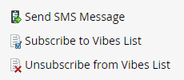

# Verwenden von SMS-Optionen in einer Smart-Kampagne {#using-sms-options-in-a-smart-campaign}

Nach [SMS erstellen](/help/marketo/product-docs/mobile-marketing/vibes-sms-messages/create-an-sms-message-2.md){target="_blank"}verwenden, sollten Sie Smart-List-Trigger und -Filter in einer Smart-Kampagne verwenden, um die Vorteile zu nutzen.

>[!NOTE]
>
>Wenn Sie eine SMS senden möchten, haben wir eine [spezifischer Artikel](/help/marketo/product-docs/mobile-marketing/vibes-sms-messages/send-an-sms-message.md){target="_blank"} dafür.

>[!PREREQUISITES]
>
>SMS-Trigger/-Filter werden nur angezeigt, wenn die Variable [Der Dienst &quot;Vibes&quot;wurde aktiviert](/help/marketo/product-docs/mobile-marketing/admin/add-vibes-as-a-launchpoint-service.md){target="_blank"}.

## SMS-Trigger {#sms-triggers}

<table style="width:600px">
  <tr>
    <td style="width:50%"></td>
    <td style="width:50%"></td>
  </tr>
</table>

Im Folgenden finden Sie einige Beispiele:

Die **SMS-Nachrichtenabsprünge** Trigger startet einen Fluss, z. B. das Senden einer E-Mail, wenn eine SMS-Nachricht abbricht.

Die **Abonniert die Vibes-Liste** Trigger löst einen Ablauf aus, wenn sich eine Person anmeldet.

Die **Klicks Link in SMS-Nachricht** Trigger löst einen Fluss aus, wenn ein Besucher auf einen Link in der SMS klickt.

## SMS-Filter {#sms-filters}

<table style="width:600px">
  <tr>
    <td style="width:50%"></td>
    <td style="width:50%"></td>
  </tr>
</table>

Die **Abonnieren der Vibes-Liste** filter findet alle Personen, die *ever* abonniert Vibes. Dies umfasst sowohl abgemeldete als auch gelöschte Personen, auch wenn gelöschte Personen im Fluss weggelassen werden. Dieser Filter eignet sich am besten für Berichte.

Im Gegensatz dazu wird die Variable **Mitglied der Vibes List** filter findet _everyone_ hat sich derzeit für Vibes angemeldet und eignet sich am besten für die Verwendung in Smart-Kampagnen oder -Listen.

>[!NOTE]
>
>Alle SMS-Filter enthalten **Datum der Aktivität** -Beschränkung standardmäßig.

## SMS-Flussschritte {#sms-flow-steps}

Es gibt drei Schritte für den SMS-Ablauf, aus denen Sie wählen können.

<table>
<tbody>
  <tr>
    <td style="width:20%"><b>SMS-Nachricht senden</b></td>
    <td>Mit dieser Flussaktion werden Nachrichten an Personen aus der Smart-Liste von Marketo gesendet, die sich für eine angemeldete Abonnementliste von Vibes angemeldet haben. Der Abonnementprozess wird nicht initiiert. <a href="/help/marketo/product-docs/mobile-marketing/vibes-sms-messages/send-an-sms-message.md">Weitere Infos</a>.</td>
  </tr>

<tr>
    <td style="width:20%"><b>Vibes-Liste abonnieren</b></td>
    <td>Mit dieser Flussaktion wird der SMS-Abonnementprozess über eine vom Benutzer ausgewählte Vibes-Akquise-Kampagne initiiert. Vibes sendet dann eine Bestätigungsnachricht und der Empfänger muss innerhalb von 24 Stunden mit "Y"antworten, um die Anmeldung zu bestätigen. Nachdem sich der Benutzer angemeldet hat, wird er Mitglied Ihrer zugehörigen Vibes-Abonnementliste.</td>
  </tr>
  <tr>
    <td style="width:20%"><b>Von Vibes-Liste abmelden</b></td>
    <td>Mit dieser Flussaktion wird die Anmeldung jeder Person von einer angemeldeten Benutzer-Abonnementliste für Vibes aufgehoben. Wenn ein Benutzer "STOP"in Ihren Code schreibt, wird sein Personendatensatz aktualisiert, um anzuzeigen, dass er nicht mehr Mitglied der Vibes-Abonnementliste ist.</td>
  </tr>
  </tbody>
</table>

>[!NOTE]
>
>Die **Abonnieren der Vibes-Liste** und **Abmeldung von der Vibes-Liste** -Flüsse haben unterschiedliche Anforderungen. Für **Abonnieren** müssen Sie die Vibes-Liste und die Vibes-Akquise-Kampagne auswählen. Für **Abmelden**, ist nur die Vibes-Liste erforderlich.

>[!MORELIKETHIS]
>
>* [SMS-Nachricht senden](/help/marketo/product-docs/mobile-marketing/vibes-sms-messages/send-an-sms-message.md){target="_blank"}
>* [Definieren einer Smart-Liste für eine intelligente Kampagne | Trigger](/help/marketo/product-docs/core-marketo-concepts/smart-campaigns/creating-a-smart-campaign/define-smart-list-for-smart-campaign-trigger.md){target="_blank"}
>* [Definieren einer Smart-Liste für eine intelligente Kampagne | Batch](/help/marketo/product-docs/core-marketo-concepts/smart-campaigns/creating-a-smart-campaign/define-smart-list-for-smart-campaign-batch.md){target="_blank"}
