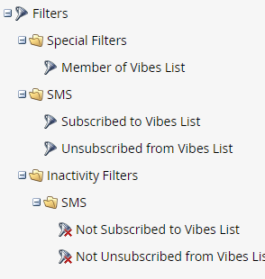

# Verwenden von SMS-Optionen in einer Smart-Kampagne {#using-sms-options-in-a-smart-campaign}

Nachdem Sie [eine SMS-Nachricht erstellt haben](/help/marketo/product-docs/mobile-marketing/vibes-sms-messages/create-an-sms-message.md){target="_blank"}, sollten Sie Smart-List-Trigger und -Filter in einer Smart-Kampagne verwenden, um die Vorteile zu nutzen.

>[!NOTE]
>
>Wenn Sie eine SMS-Nachricht senden möchten, haben wir dafür einen [spezifischen Artikel](/help/marketo/product-docs/mobile-marketing/vibes-sms-messages/send-an-sms-message.md){target="_blank"}.

>[!PREREQUISITES]
>
>SMS-Trigger/-Filter werden nur angezeigt, wenn der [Video-Dienst aktiviert wurde](/help/marketo/product-docs/mobile-marketing/admin/add-vibes-as-a-launchpoint-service.md){target="_blank"}.

## SMS-Trigger {#sms-triggers}

<table style="width:600px">
  <tr>
    <td style="width:50%"></td>
    <td style="width:50%"></td>
  </tr>
</table>

Im Folgenden finden Sie einige Beispiele:

Der Trigger **SMS-Nachrichten-Bounces** löst einen Fluss aus, z. B. den Versand einer E-Mail, wenn eine SMS-Nachricht abspringt.

Der Trigger **Abonniert die Vibes-Liste** löst einen Ablauf aus, wenn sich eine Person anmeldet.

Der Trigger **Klicks auf Link in SMS-Nachricht** löst einen Fluss aus, wenn ein Benutzer auf einen Link in der SMS klickt.

## SMS-Filter {#sms-filters}

<table style="width:600px">
  <tr>
    <td style="width:50%"></td>
    <td style="width:50%"></td>
  </tr>
</table>

Der Filter **An die Liste der Segmente angemeldet** findet jeden, der *jemals* für Vibes angemeldet hat. Dies umfasst sowohl abgemeldete als auch gelöschte Personen, auch wenn gelöschte Personen im Fluss weggelassen werden. Dieser Filter eignet sich am besten für Berichte.

Im Gegensatz dazu findet der Filter **Mitglied der Vibes-Liste** _jeder_ , der sich derzeit für Vibes angemeldet hat, und eignet sich am besten für die Verwendung in Smart-Kampagnen oder Listen.

>[!NOTE]
>
>Alle SMS-Filter enthalten standardmäßig die Beschränkung **Datum der Aktivität** .

## SMS-Flussschritte {#sms-flow-steps}

Es gibt drei Schritte für den SMS-Ablauf, aus denen Sie wählen können.

<table>
<tbody>
  <tr>
    <td style="width:20%"><b>SMS-Nachricht senden</b></td>
    <td>Mit dieser Flussaktion werden Nachrichten an Personen aus der Smart-Liste von Marketo gesendet, die sich für eine angemeldete Abonnementliste von Vibes angemeldet haben. Der Abonnementprozess wird nicht initiiert. <a href="/help/marketo/product-docs/mobile-marketing/vibes-sms-messages/send-an-sms-message.md">Weitere Infos</a>.</td>
  </tr>

<tr>
    <td style="width:20%"><b>Abonnement der Vibes-Liste</b></td>
    <td>Mit dieser Flussaktion wird der SMS-Abonnementprozess über eine vom Benutzer ausgewählte Vibes-Akquise-Kampagne initiiert. Vibes sendet dann eine Bestätigungsnachricht und der Empfänger muss innerhalb von 24 Stunden mit "Y"antworten, um die Anmeldung zu bestätigen. Nachdem sich der Benutzer angemeldet hat, wird er Mitglied Ihrer zugehörigen Vibes-Abonnementliste.</td>
  </tr>
  <tr>
    <td style="width:20%"><b>Abbestelltes Abonnement der Vibes-Liste</b></td>
    <td>Mit dieser Flussaktion wird die Anmeldung jeder Person von einer angemeldeten Benutzer-Abonnementliste für Vibes aufgehoben. Wenn ein Benutzer "STOP"in Ihren Code schreibt, wird sein Personendatensatz aktualisiert, um anzuzeigen, dass er nicht mehr Mitglied der Vibes-Abonnementliste ist.</td>
  </tr>
  </tbody>
</table>

>[!NOTE]
>
>Die Flüsse **Abonnieren der Vibes-Liste** und **Abmelden von der Vibes-Liste** haben unterschiedliche Anforderungen. Für **Abonnieren** müssen Sie die Vibes-Liste und die Vibes-Akquise-Kampagne auswählen. Für **Unsubscribe** ist nur die Vibes-Liste erforderlich.

>[!MORELIKETHIS]
>
>* [SMS-Nachricht senden](/help/marketo/product-docs/mobile-marketing/vibes-sms-messages/send-an-sms-message.md){target="_blank"}
>* [Definieren einer Smart-Liste für Smart-Campaign | Trigger](/help/marketo/product-docs/core-marketo-concepts/smart-campaigns/creating-a-smart-campaign/define-smart-list-for-smart-campaign-trigger.md){target="_blank"}
>* [Definieren einer Smart-Liste für Smart-Campaign | Batch](/help/marketo/product-docs/core-marketo-concepts/smart-campaigns/creating-a-smart-campaign/define-smart-list-for-smart-campaign-batch.md){target="_blank"}
