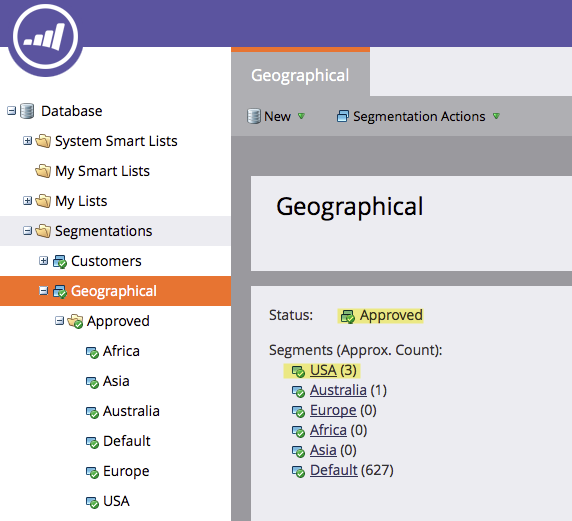

# Genehmigen einer Segmentierung {#approve-a-segmentation}

Eine Segmentierung muss genehmigt werden, bevor sie verwendet werden kann.

>[!PREREQUISITES]
>
>* [Erstellen einer Segmentierung](/help/marketo/product-docs/personalization/segmentation-and-snippets/segmentation/create-a-segmentation.md)
>* [Segmentregeln definieren](/help/marketo/product-docs/personalization/segmentation-and-snippets/segmentation/define-segment-rules.md)

>[!NOTE]
>
>Es können maximal 20 Segmente gleichzeitig genehmigt werden.

1. Navigieren Sie zu **Datenbank**.

   

1. Klicken Sie in der Segmentierung auf **Segmentierungsaktionen**, und dann **Genehmigen**.

   

   >[!NOTE]
   >
   >Der Status ändert sich in Mit einem Drehrad genehmigen ( ), während die Validierung ausgeführt wird.

   >[!CAUTION]
   >
   >Je nach Größe der Datenbank kann es einige Minuten bis zu mehr als einem Tag dauern, bis die Genehmigung abgeschlossen ist.

   Nach der Genehmigung ändert sich der Status von Genehmigen in Genehmigt .
   

   >[!TIP]
   >
   >Die Anzahl der Personen in jedem Segment wird in Klammern neben dem Segmentnamen angezeigt.

1. Die **Personen** im **Segment** zeigt nun die endgültige Liste der Personen für das Segment an.

   

>[!CAUTION]
>
>Die Gesamtanzahl der Segmente, die Sie in einer Segmentierung erstellen können, hängt von der Anzahl und dem Typ der verwendeten Filter sowie davon ab, wie komplex die Logik Ihrer Segmente ist. Sie können zwar bis zu 100 Segmente mithilfe von Standardfeldern erstellen, aber die Verwendung anderer Filtertypen kann die Komplexität erhöhen und Ihre Segmentierung kann möglicherweise nicht genehmigt werden. Beispiele sind: benutzerdefinierte Felder, Listenmitglieder, Lead-Inhaber-Felder und Umsatzstufen.
>
>Wenn Sie eine Fehlermeldung während der Validierung erhalten und Unterstützung bei der Reduzierung der Komplexität Ihrer Segmentierung benötigen, wenden Sie sich an [Marketo-Support](https://nation.marketo.com/t5/Support/ct-p/Support).

>[!MORELIKETHIS]
>
>[Verwenden von Segmentfiltern in einer Smart-Liste](/help/marketo/product-docs/personalization/segmentation-and-snippets/segmentation/use-segment-filters-in-a-smart-list.md)
