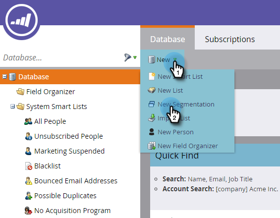
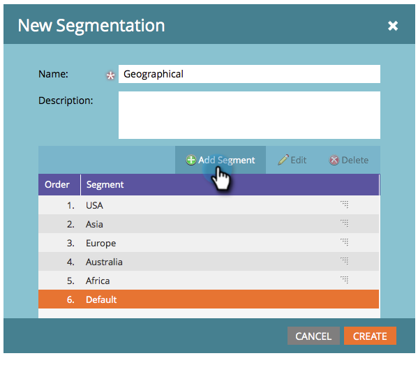

# Erstellen einer Segmentierung {#create-a-segmentation}

Mit der Segmentierung können Sie Personen für Berichte und dynamische Inhalte in unterschiedlichen Profilen gruppieren. So können Sie sie erstellen:

1. Wechseln Sie zu **Datenbank**.

   

1. Klicken Sie auf **Neu** und dann auf **Neue Segmentierung**.

   

   >[!TIP]
   >
   >Sie können bis zu 20 Segmentierungen erstellen.

1. Geben Sie einen **Namen** ein, klicken Sie auf **Segment hinzufügen** und benennen Sie es.

   

   >[!NOTE]
   >
   >Standard kann nicht verschoben, bearbeitet oder gelöscht werden.

1. Fügen Sie beliebig viele Segmente hinzu (bis zu 100).

   

   >[!CAUTION]
   >
   >Die Gesamtzahl der Segmente, die Sie in einer Segmentierung erstellen können, hängt von der Anzahl und dem Typ der verwendeten Filter sowie davon ab, wie komplex die Logik Ihrer Segmente ist. Sie können zwar mithilfe von Standardfeldern bis zu 100 Segmente erstellen, aber die Verwendung anderer Filtertypen kann die Komplexität erhöhen, und Ihre Segmentierung kann möglicherweise nicht genehmigt werden. Einige Beispiele sind: benutzerdefinierte Felder, Felder für Mitglieder der Liste, Felder für Lead-Inhaber und Umsatzstadien.
   >
   >Wenn Sie während der Genehmigung eine Fehlermeldung erhalten und Unterstützung beim Reduzieren der Komplexität Ihrer Segmentierung benötigen, wenden Sie sich an den [Marketo-Support](https://nation.marketo.com/t5/Support/ct-p/Support).

1. Segmente per Drag-and-Drop verschieben, um ihre Reihenfolge zu ändern. Klicken Sie abschließend auf **Erstellen**.

   

   >[!NOTE]
   >
   >Eine Person qualifiziert sich für das erste passende Segment in der definierten [Reihenfolge](/help/marketo/product-docs/personalization/segmentation-and-snippets/segmentation/segmentation-order-priority.md).

   >[!NOTE]
   >
   >Sie müssen Segmentregeln definieren, bevor Sie Ihre Segmentierung verwenden können.

   Herzlichen Glückwunsch! Sie sind der Verwendung dynamischer Inhalte einen Schritt näher gekommen.

   >[!MORELIKETHIS]
   >
   >[Definieren von Segmentregeln](/help/marketo/product-docs/personalization/segmentation-and-snippets/segmentation/define-segment-rules.md)
