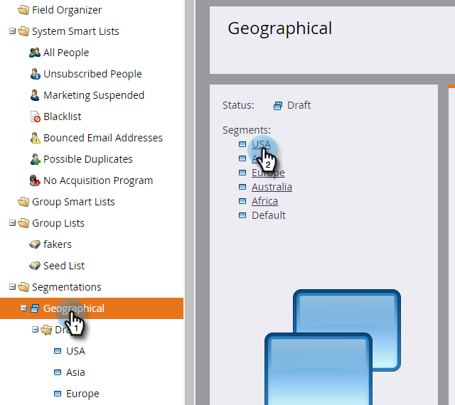
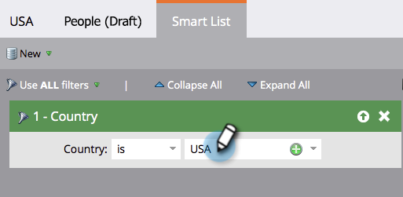
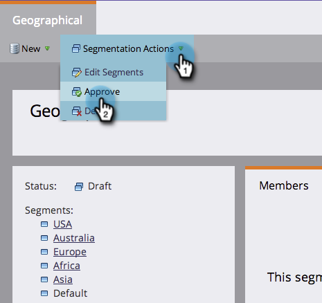

# Definieren von Segmentregeln {#define-segment-rules}

Durch das Definieren von Segmentregeln können Sie Ihre Personen in verschiedene sich gegenseitig ausschließende Gruppen kategorisieren.

>[!PREREQUISITES]
>
>[Segmentierung erstellen](/help/marketo/product-docs/personalization/segmentation-and-snippets/segmentation/create-a-segmentation.md)

1. Navigieren Sie zur **[!UICONTROL Datenbank]**.

   

1. Wählen Sie **[!UICONTROL Segmentierungen]** aus der Baumstruktur aus und klicken Sie dann auf ein bestimmtes **Segment**.

   

1. Klicken Sie auf **[!UICONTROL Smart-Liste]** und fügen Sie Filter hinzu.

   

   >[!CAUTION]
   >
   >Segmente unterstützen derzeit keine _In Past_ und _In Timeframe_ für Filter. Dies liegt daran, dass Segmentierungen nur dann auf Aktualisierungen prüfen, wenn eine Änderung des Datenwerts protokolliert wird. Diese Werte werden _nicht_ für Dinge protokolliert, die sich automatisch ändern, z. B. Formelfelder und Daten. Darüber hinaus werden Datumsoperatoren mit relativen Datumsbereichen nicht unterstützt, da sie zum Zeitpunkt der Segmentierungsgenehmigung und nicht zum Zeitpunkt einer Aktivität „Datenwert ändern“ berechnet werden.

   >[!NOTE]
   >
   >Die Filter &quot;SFDC-Typ“ und &quot;Microsoft-Typ“ werden derzeit in Smart-Listen für die Segmentierung nicht unterstützt.

1. Füllen Sie die entsprechenden Werte für die Filter aus.

   

   >[!CAUTION]
   >
   >Das Verhalten der Aktivitätsprotokollierung für Kontofelder kann sich auf die Qualifizierung auswirken. Daher raten wir davon ab, bei der Definition von Segmentregeln Kontofelder zu verwenden.

1. Klicken Sie auf **[!UICONTROL Personen (Entwurf)]**, um die Personen anzuzeigen, die sich möglicherweise als Mitglied dieses Segments qualifizieren.

   

1. Navigieren Sie **[!UICONTROL Segmentierungsaktionen]**. Klicken Sie **[!UICONTROL Genehmigen]**.

   

   >[!CAUTION]
   >
   >Die Gesamtzahl der Segmente, die Sie in einer Segmentierung erstellen können, hängt von der Anzahl und dem Typ der verwendeten Filter sowie davon ab, wie komplex die Logik Ihrer Segmente ist. Sie können zwar mithilfe von Standardfeldern bis zu 100 Segmente erstellen, aber die Verwendung anderer Filtertypen kann die Komplexität erhöhen, und Ihre Segmentierung kann möglicherweise nicht genehmigt werden. Einige Beispiele sind: benutzerdefinierte Felder, Felder für Mitglieder der Liste, Felder für Lead-Inhaber und Umsatzstadien.
   >
   >Wenn Sie während der Genehmigung eine Fehlermeldung erhalten und Unterstützung beim Reduzieren der Komplexität Ihrer Segmentierung benötigen, wenden Sie sich an den [Marketo-Support](https://nation.marketo.com/t5/support/ct-p/Support?profile.language=de).

1. Im Dashboard erhalten Sie einen schnellen Überblick über Ihre Segmente in einem Tortendiagramm sowie über die angewendeten Regeln.

   

Gute Arbeit! Diese Segmente werden an vielen Stellen in Marketo nützlich sein.

>[!NOTE]
>
>Eine Person kann sich für verschiedene Segmente qualifizieren, gehört aber letztendlich zu nur einem Segment, das von der [Prioritätsreihenfolge der Segmente“ ](/help/marketo/product-docs/personalization/segmentation-and-snippets/segmentation/segmentation-order-priority.md).

>[!NOTE]
>
>Der Bildschirm [!UICONTROL Personen (Entwurf)] zeigt alle Personen an, die sich als Mitglied qualifizieren, und ist nicht immer die endgültige Liste der Personen. Genehmigen Sie Ihr Segment, um die endgültige Liste zu sehen.

>[!MORELIKETHIS]
>
>[Segmentierung genehmigen](/help/marketo/product-docs/personalization/segmentation-and-snippets/segmentation/approve-a-segmentation.md)
