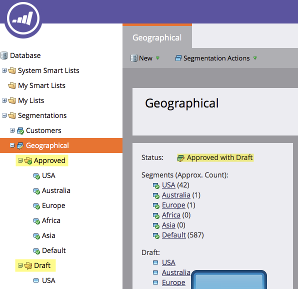

# Bearbeiten einer Segmentierung {#edit-a-segmentation}

Änderungen an vorhandenen Segmentierungen sind einfach. Hier ist der Tiefpunkt.

## Erstellen eines Segmentierungsentwurfs {#create-a-segmentation-draft}

1. Navigieren Sie zur **[!UICONTROL Datenbank]**.

   

1. Klicken Sie in Ihrer Segmentierung auf **[!UICONTROL Segmentierungsaktionen]** und dann auf **[!UICONTROL Entwurf erstellen]**.

   

1. Der **[!UICONTROL Status]** ändert sich in [!UICONTROL Genehmigt mit Entwurf]. In **[!UICONTROL Segmentierung]** ein Ordner „Entwurf“ erstellt.

   

## Hinzufügen, Bearbeiten oder Löschen von Segmenten {#add-edit-or-delete-segments}

1. Klicken Sie in Ihrer Segmentierung auf **[!UICONTROL Segmentierungsaktionen]** und dann auf **[!UICONTROL Segmente bearbeiten]**.

   

   >[!NOTE]
   >
   >Sie können nur Segmente eines [!UICONTROL Entwurfs“ bearbeiten] nicht die genehmigte Segmentierung.

1. **[!UICONTROL Segment hinzufügen]**, **[!UICONTROL Bearbeiten]** vorhandenes (umbenennen oder ändern der Reihenfolge) oder **[!UICONTROL Löschen]** beliebige Segmente.

   

   >[!NOTE]
   >
   >Sie müssen ein Segment auswählen, bevor Sie es bearbeiten oder löschen können.

   >[!CAUTION]
   >
   >Das Löschen wirkt sich auf alle zugehörigen dynamischen Inhalte in E-Mails, Landingpages und Snippets aus. **Es gibt kein Rückgängig-**. Überprüfen Sie die Registerkarte **[!UICONTROL Verwendet von]**, um zu sehen, was dieses Segment verwendet.

## Segmentregeln bearbeiten {#edit-segment-rules}

1. Navigieren Sie in [!UICONTROL Entwurf] **Segment** zu **[!UICONTROL Smart List]**. Wenden Sie Regeln ähnlich wie [Segmentregeln definieren](/help/marketo/product-docs/personalization/segmentation-and-snippets/segmentation/define-segment-rules.md) an.

   

   >[!NOTE]
   >
   >Genehmigte Segmente können nicht bearbeitet werden. Klicken Sie auf Segmente im Ordner [!UICONTROL Entwurf], um sie zu bearbeiten.

   >[!NOTE]
   >
   >Denken Sie daran, Ihren Segmentierungsentwurf zu genehmigen.

Sie können auch mit Segmentierungen experimentieren, die nicht in dynamischen Inhalten verwendet werden.

>[!MORELIKETHIS]
>
>[Segmentierung löschen](/help/marketo/product-docs/personalization/segmentation-and-snippets/segmentation/delete-a-segmentation.md)
