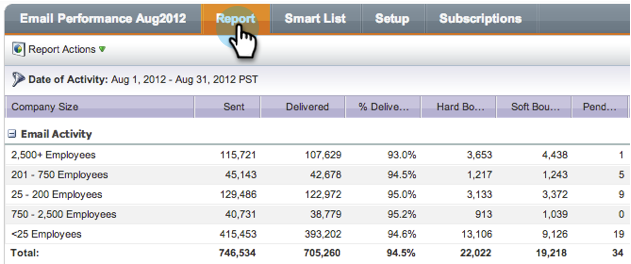

# Gruppieren von E-Mail-Berichten nach Segmentierungen {#group-email-reports-by-segmentations}

Segmentierungen dienen nicht nur dynamischen Inhalten. Sie können Ihren E-Mail-Leistungsbericht auch nach Segmentierungen gruppieren.

>[!PREREQUISITES]
>
>[Segmentierung genehmigen](/help/marketo/product-docs/personalization/segmentation-and-snippets/segmentation/approve-a-segmentation.md)

1. Navigieren Sie zum Bereich **[!UICONTROL Marketing]** (oder **[!UICONTROL Analytics]**).

   

1. Wählen Sie Ihren **[!UICONTROL E-Mail]** Leistungsbericht.

   

1. Klicken Sie auf **[!UICONTROL Setup]** und ziehen Sie per Drag-and **[!UICONTROL Drop auf „Gruppieren nach Segmentierungen]**.

   

1. Wählen Sie ein oder zwei Segmente aus, die für die Gruppierung Ihres Berichts verwendet werden sollen. Klicken Sie auf **[!UICONTROL Übernehmen]**.

   

1. Das ist alles! Klicken Sie auf **[!UICONTROL Registerkarte]** Bericht“. Wenn Sie eine Segmentierung verwenden, zeigt Ihr Bericht für jedes Segment eine Zeile an.

   

1. Wenn Sie zwei Segmentierungen verwenden, wird für jede Segmentkombination _eine_ angezeigt.

   

>[!MORELIKETHIS]
>
>[Filtern von Assets in einem E-Mail-Bericht](/help/marketo/product-docs/reporting/basic-reporting/report-activity/filter-assets-in-an-email-report.md)
