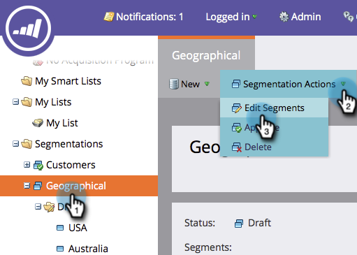

# Segmentierungsreihenfolge - Priorität {#segmentation-order-priority}

Es ist wichtig zu verstehen, wie **bestellen** legt die Priorität für die Bewertung Ihrer Personen in einer Segmentierung fest.

>[!PREREQUISITES]
>
>[Erstellen einer Segmentierung](/help/marketo/product-docs/personalization/segmentation-and-snippets/segmentation/create-a-segmentation.md)
>[Segmentregeln definieren](/help/marketo/product-docs/personalization/segmentation-and-snippets/segmentation/define-segment-rules.md)

1. Navigieren Sie zu **Datenbank**.

   

1. Wählen Sie **Segmentierung**. In **Segmentierungsaktionen** klicken **Segmente bearbeiten**.

   

   >[!NOTE]
   >
   >Sie können nur einen Entwurf Ihrer Segmentierung bearbeiten.

   Über diesen Bildschirm können Sie die Reihenfolge Ihrer Segmente überprüfen oder bearbeiten.

   

>[!NOTE]
>
>* Die Segmente schließen sich gegenseitig aus. Eine Person kann jeweils nur einem Segment angehören.
>* Wenn eine Person für zwei Segmente qualifiziert ist, gehört sie nur zum ersten Segment in der Liste.
>* Wenn eine Person nicht für ein Segment qualifiziert ist, wird sie Mitglied des Standardsegments.

Cool, was? Sie können Segmente für dynamische Inhalte, Berichte und sogar in Smart-Listen verwenden.
