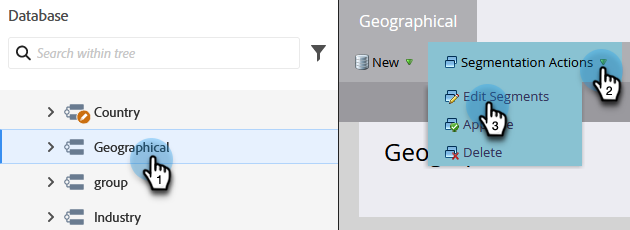

# Priorität der Segmentierungsreihenfolge {#segmentation-order-priority}

Es ist wichtig zu verstehen, wie **Reihenfolge** die Priorität für die Bewertung Ihrer Mitarbeiter in einer Segmentierung festlegt.

>[!PREREQUISITES]
>
>[Segmentierung erstellen](/help/marketo/product-docs/personalization/segmentation-and-snippets/segmentation/create-a-segmentation.md)
>[Definieren Sie Segmentregeln](/help/marketo/product-docs/personalization/segmentation-and-snippets/segmentation/define-segment-rules.md)

>[!NOTE]
>
>Eine Segmentierung kann nur im Entwurfsmodus bearbeitet werden.

1. Navigieren Sie zur **Datenbank**.

   

1. Wählen Sie Ihre **Segmentierung** aus. Klicken **unter &quot;**&quot; auf **Segmente bearbeiten**.

   

   Auf diesem Bildschirm können Sie die Reihenfolge der Segmente überprüfen oder bearbeiten.

   

>[!NOTE]
>
>* Die Segmente schließen sich gegenseitig aus. Eine Person kann immer nur Mitglied eines Segments sein.
>* Wenn sich eine Person für zwei Segmente qualifiziert, gehört sie nur zum ersten Segment in der Liste.
>* Wenn sich eine Person nicht für ein Segment qualifiziert, wird sie Mitglied des Standardsegments.
