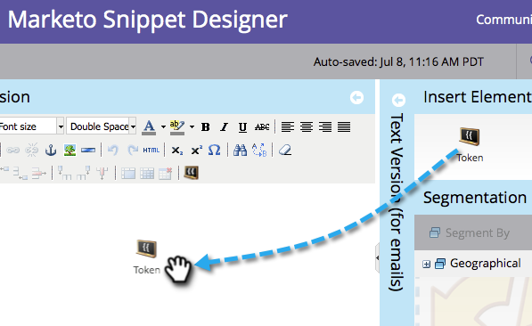

# Inhalt zu einem Snippet hinzufügen {#add-content-to-a-snippet}

>[!PREREQUISITES]
>
>[Erstellen eines Snippets](/help/marketo/product-docs/personalization/segmentation-and-snippets/snippets/create-a-snippet.md)

Sie können einem Snippet Token, Bilder, Dateien oder Rich-Text hinzufügen.

>[!NOTE]
>
>Sie können keine [Marketo-E-Mail-Syntax](/help/marketo/product-docs/email-marketing/general/email-editor-2/email-template-syntax.md) in Snippets einbetten. Dies funktioniert **nicht** in einer E-Mail. Snippets sollten nur Textinhalt sein (HTML + TEXT).

1. Wechseln Sie zu **Design Studio**.

   

1. Wählen Sie Ihren **Ausschnitt** aus und klicken Sie auf **Entwurf bearbeiten**.

   

Sie können einem Snippet drei Inhaltstypen hinzufügen.

## Token hinzufügen {#add-token}

1. Ziehen Sie das Element **Token** in den Arbeitsbereich.

   

1. Geben Sie **Token** ein und klicken Sie auf **Einfügen**.

   

## Bild/Datei hinzufügen {#add-image-file}

1. Ziehen Sie das Element **Bild/Datei** in den Arbeitsbereich.

   

   >[!NOTE]
   >
   >Sie können Ihre eigenen Bilder oder Dateien zu Marketo hinzufügen. Erfahren Sie mehr über [Bilder und Dateien](/help/marketo/product-docs/demand-generation/images-and-files/add-images-and-files-to-marketo.md).

1. Wählen Sie das zu verwendende **Bild** aus und klicken Sie auf **Einfügen**.

   

   >[!NOTE]
   >
   >Sie können auch nach einem bestimmten Bild suchen, wenn Sie dessen Namen kennen.

## Text hinzufügen {#add-text}

1. Geben Sie in den Bereich HTML-Version ein, um Text hinzuzufügen.

   

   >[!TIP]
   >
   >Verwenden Sie die Formatierungs-Tools, um Ihren Text anzupassen.

1. Klicken Sie für E-Mails auf die Registerkarte **Textversion** .

   

1. Klicken Sie auf **Von HTML kopieren**.

   

   >[!NOTE]
   >
   >Bilder, Links und Formatierung werden in der Textversion entfernt.

Cool! Jetzt können Sie eine Vielzahl von Inhalten für Ihr Snippet erstellen.

>[!MORELIKETHIS]
>
>* [Vorschau eines Snippets anzeigen](/help/marketo/product-docs/personalization/segmentation-and-snippets/snippets/preview-a-snippet.md)
>* [Einen Snippet genehmigen](/help/marketo/product-docs/personalization/segmentation-and-snippets/snippets/approve-a-snippet.md)
