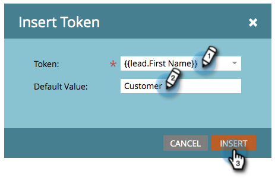
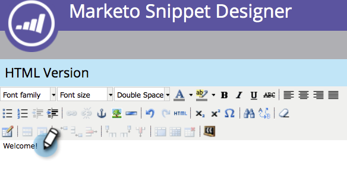
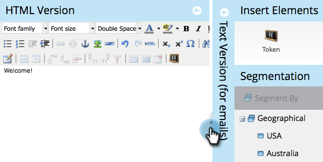

# Hinzufügen von Inhalten zu einem Ausschnitt {#add-content-to-a-snippet}

>[!PREREQUISITES]
>
>[Erstellen eines Snippets](/help/marketo/product-docs/personalization/segmentation-and-snippets/snippets/create-a-snippet.md)

Sie können Token, Bilder, Dateien oder Rich-Text zu einem Snippet hinzufügen.

>[!NOTE]
>
>Sie können keine [Marketo-E-Mail](/help/marketo/product-docs/email-marketing/general/email-editor-2/email-template-syntax.md)Syntax in Snippets einbetten. Dies funktioniert **nicht** in einer E-Mail. Snippets sollten nur Textinhalte sein (HTML + TEXT).

1. Gehen Sie zum **[!UICONTROL Design Studio]**.

   

1. Wählen Sie Ihren **Ausschnitt** aus und klicken Sie auf **[!UICONTROL Entwurf bearbeiten]**.

   

Sie können einem Snippet drei Inhaltstypen hinzufügen.

## Add [!UICONTROL Token] {#add-token}

1. Ziehen Sie das **[!UICONTROL Token]**-Element per Drag-and-Drop.

   

1. Geben Sie **[!UICONTROL Token]** ein und klicken Sie auf **[!UICONTROL Einfügen]**.

   

## Bild/Datei hinzufügen {#add-image-file}

1. Ziehen Sie das Element **[!UICONTROL Bild/Datei]** per Drag-and-Drop.

   

   >[!NOTE]
   >
   >Sie können eigene Bilder oder Dateien zu Marketo hinzufügen. Weitere Informationen zu [Bildern und Dateien](/help/marketo/product-docs/demand-generation/images-and-files/add-images-and-files-to-marketo.md).

1. Wählen Sie **zu** Bild aus und klicken Sie auf **[!UICONTROL Einfügen]**.

   

   >[!NOTE]
   >
   >Sie können auch nach einem bestimmten Bild suchen, wenn Sie dessen Namen kennen.

## Text hinzufügen {#add-text}

1. Geben Sie im Bereich HTML-Version ein, um Text hinzuzufügen.

   

   >[!TIP]
   >
   >Verwenden Sie die Formatierungswerkzeuge, um Ihren Text anzupassen.

1. Klicken Sie für E-Mails auf **[!UICONTROL Registerkarte (Textversion (für E-Mails]**.

   

1. Klicken Sie **[!UICONTROL Aus HTML kopieren]**.

   

   >[!NOTE]
   >
   >Bilder, Links und Formatierungen werden in der Textversion entfernt.

Cool! Jetzt können Sie eine Vielzahl von Inhalten für Ihr Snippet erstellen.

>[!MORELIKETHIS]
>
>* [Vorschau eines Snippets](/help/marketo/product-docs/personalization/segmentation-and-snippets/snippets/preview-a-snippet.md)
>* [Genehmigen eines Snippets](/help/marketo/product-docs/personalization/segmentation-and-snippets/snippets/approve-a-snippet.md)
