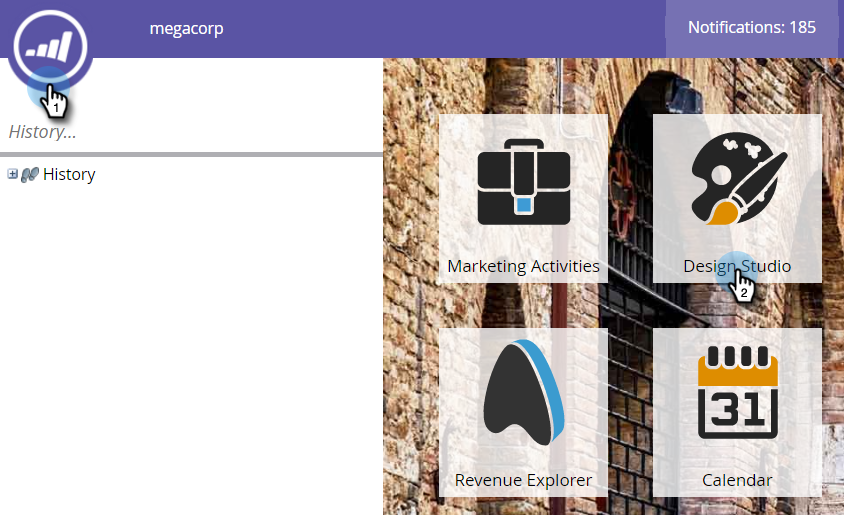

# Snippet ohne Entwurf genehmigen {#approve-a-snippet-with-no-draft}

## Snippet genehmigen {#approve-the-snippet}

&quot;Kein Entwurf&quot;wird jedes Mal ausgelöst, wenn ein Snippet genehmigt wird. Dazu gehört ein Snippet, das von Assets in anderen Arbeitsbereichen freigegeben oder referenziert wird.

1. Gehen Sie zu **Design Studio**.

   

1. Wählen Sie ein Snippet aus und wählen Sie in der Dropdown-Liste &quot; **Snippet-Aktionen** &quot;die Option &quot; **Genehmigen**&quot;.

   

1. Wählen Sie eine Option im Dialogfeld &quot;Snippet genehmigen&quot;und klicken Sie auf **Genehmigen**:

   * **Alle** aktualisieren: Mit dieser Option werden keine Entwürfe der genehmigten Assets mit dem Snippet erstellt. Alle Assets erhalten die Aktualisierungen und behalten ihren vorherigen Status bei. Oben rechts im Bildschirm wird ein Fortschrittsmodul angezeigt. es kann jederzeit geschlossen werden. Um es wiederherzustellen, klicken Sie mit der rechten Maustaste auf den Namen des Codeausschnitts und wählen Sie &quot;Genehmigungsstatus anzeigen&quot;.
   * **Entwürfe** erstellen: Mit dieser Option werden Entwürfe der genehmigten Assets mit dem Snippet erstellt. Wählen Sie diese Option, wenn die Änderungen am Snippet zuerst überprüft werden müssen. Alle Entwürfe müssen manuell genehmigt werden.

   

   >[!NOTE]
   >
   >Für ein neues Snippet, das noch nicht verwendet wird, wird der Bildschirm &quot;Entwurf genehmigen&quot;nicht angezeigt. Es wird angezeigt, wenn das Snippet in einem oder mehreren Assets verwendet wird.

>[!CAUTION]
>
>Mit dieser Funktion sparen Sie Zeit mit dem Arbeitsablauf für die Segmentgenehmigung. Es gibt jedoch einige Einschränkungen, die man beachten muss. Weitere Informationen finden Sie in [diesem Dokument](https://nation.marketo.com/docs/DOC-4415) . Das Dokument enthält außerdem Informationen zur Fehlerbearbeitung und Fehlerbehebung.

>[!NOTE]
>
>**Verwandte Artikel**
>
>[No-Draft für Snippets aktivieren](../../../../product-docs/administration/users-and-roles/managing-user-roles-and-permissions/enable-no-draft-for-snippets.md)

