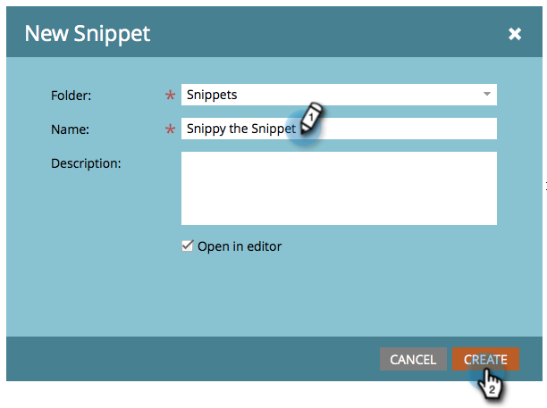

# Erstellen eines Ausschnitts {#create-a-snippet}

Snippets können als dynamische Inhaltsbausteine für (E **Mails** und **Landingpages)** werden.

1. Gehen Sie zum **[!UICONTROL Design Studio]**.

   

1. Klicken Sie auf **[!UICONTROL Neu]** und dann auf **[!UICONTROL Neues Snippet]**.

   

1. Geben Sie die erforderlichen Details ein und klicken Sie auf **[!UICONTROL Erstellen]**.

   

Gute Arbeit! Vereinfachen Sie Ihre Arbeit, indem Sie Ausschnitte für Ihre dynamischen Inhalte erstellen. Jetzt können Sie fortfahren und [Inhalt zu Ihrem neuen Snippet hinzufügen](/help/marketo/product-docs/personalization/segmentation-and-snippets/snippets/add-content-to-a-snippet.md).

>[!MORELIKETHIS]
>
>* [Hinzufügen von Inhalt zu einem Snippet](/help/marketo/product-docs/personalization/segmentation-and-snippets/snippets/add-content-to-a-snippet.md)
>* [Verstehen dynamischer Inhalte](/help/marketo/product-docs/personalization/segmentation-and-snippets/segmentation/understanding-dynamic-content.md)
