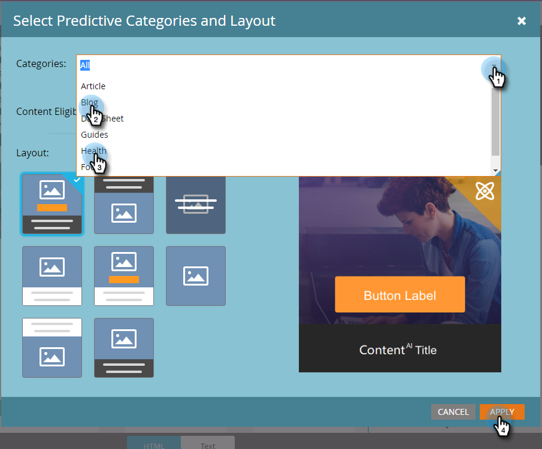

# Aktivieren prädiktiver Inhalte in E-Mails {#enable-predictive-content-in-emails}

Erstellen Sie ein oder mehrere Bilder in Ihrer E-Mail prädiktiv und passen Sie das Erlebnis für jeden Empfänger an.

>[!NOTE]
>
>Es wird empfohlen, mehr als fünf Inhaltselemente pro Kategorie und Quelle (E-Mail, Rich-Media, Balken) zu aktivieren, bevor Sie prädiktive Inhalte testen und verwenden. Mehr Inhalte bieten ein besseres prognostiziertes Ergebnis.

>[!PREREQUISITES]
>
>Bevor Sie prädiktive Inhalte aktivieren, müssen Sie:
>
>* **Prädiktive Inhalte vorbereiten**
>
>   * [Prädiktiven Inhalt für E-Mails bearbeiten](/help/marketo/product-docs/predictive-content/working-with-predictive-content/edit-predictive-content-for-emails.md){target="_blank"} oder
>   * [Bearbeiten prädiktiver Inhalte für Rich Media](/help/marketo/product-docs/predictive-content/working-with-predictive-content/edit-predictive-content-for-rich-media.md){target="_blank"} oder
>   * [Bearbeiten prädiktiver Inhalte für die Empfehlungsleiste](/help/marketo/product-docs/predictive-content/working-with-predictive-content/edit-predictive-content-for-the-recommendation-bar.md){target="_blank"}
>
>* [Genehmigen eines Titels für Prognoseinhalte](/help/marketo/product-docs/predictive-content/working-with-all-content/approve-a-title-for-predictive-content.md){target="_blank"}

## Hinzufügen prädiktiver Inhalte mit dem E-Mail-Editor 2.0 {#adding-predictive-content-using-the-email-editor}

1. Klicken Sie **[!UICONTROL Marketing-Aktivitäten]**.

   

1. Wählen Sie Ihre E-Mail aus und klicken Sie **[!UICONTROL Entwurf bearbeiten]**.

   

1. Klicken Sie auf das Bild, das Sie prädiktiv gestalten möchten. Wenn das Zahnradsymbol angezeigt wird, klicken Sie darauf und wählen **[!UICONTROL ContentAI aktivieren]** (ContentAI ist der frühere Name für Prognoseinhalte).

   

1. Um eine oder mehrere Kategorien auszuwählen, klicken Sie auf **[!UICONTROL Kategorien]** Dropdown-Liste, nehmen Sie Ihre Auswahl(en) vor und klicken Sie auf **[!UICONTROL Anwenden]**.

   

   >[!NOTE]
   >
   >Die Auswahl bestimmter Kategorien oder die Änderung des prädiktiven Layouts ist optional.

1. Ihr Bild ist jetzt prädiktiv. Wiederholen Sie die Schritte 3 und 4 für weitere Bilder (falls gewünscht).

   

1. Um eine Vorschau Ihrer E-Mail anzuzeigen **[!UICONTROL klicken Sie]** der oberen rechten Ecke auf „Vorschau“.

   

1. Um verschiedene mögliche Bilder anzuzeigen, klicken Sie auf **[!UICONTROL Aktualisieren]**.

   

   >[!NOTE]
   >
   >Das Bild wird erst ausgewählt **_wenn der Empfänger die E-Mail öffnet_**. Was Sie also in der Vorschau sehen, ist nur ein Beispiel und ist nicht unbedingt das Bild, das der Empfänger sieht.

1. Nachdem Sie die Vorschau Ihrer E-Mail abgeschlossen haben, klicken Sie auf die Dropdown-Liste **[!UICONTROL Vorschauaktionen]** und wählen Sie **[!UICONTROL Genehmigen und schließen]**. Oder klicken Sie, falls Sie noch Bearbeitungsaufgaben haben, auf **[!UICONTROL rechten Seite]** Entwurf bearbeiten“.

   

   >[!NOTE]
   >
   >Beim Versand eines Beispiels wird ein zufälliges Bild ausgewählt.

Nachdem Sie Ihre E-Mail genehmigt haben, ist sie mit prädiktivem Inhalt ausgestattet und kann gesendet werden!

>[!CAUTION]
>
>Wenn ein Empfänger die E-Mail öffnet, werden die prädiktiven Bilder gesperrt. Wenn der Inhalt später entfernt wird, wird den Empfängerinnen und Empfängern ein beschädigtes Bild angezeigt, in dem der Inhalt gespeichert wurde.

## Hinzufügen prädiktiver Inhalte, wenn der E-Mail-Editor 2.0 nicht verwendet wird {#adding-predictive-content-when-not-using-the-email-editor}

Wenn Sie keine Vorlage vom Typ [E-Mail 2.0](/help/marketo/product-docs/email-marketing/general/email-editor-2/email-editor-v2-0-overview.md){target="_blank"} verwenden, können Sie Ihrer E-Mail prädiktiven Inhalt hinzufügen, indem Sie ein Bild in Ihrer Vorlage als von Marketo bearbeitbares Bildelement taggen.

Informationen zur [Marketo-spezifischen Syntax finden Sie hier](/help/marketo/product-docs/email-marketing/general/email-editor-2/email-template-syntax.md#elements){target="_blank"}.

Im Folgenden finden Sie ein Beispiel dafür, wie der Code aussehen sollte (dies ist nur ein Beispiel. Kopieren Sie den unten stehenden Code nicht genau).

**Beispiel**

```example
<div class="mktoImg" id="exampleImg" mktoName="Example Image" mktoImgLink="https://www.marketo.com">
<a></a>
</div>
```
