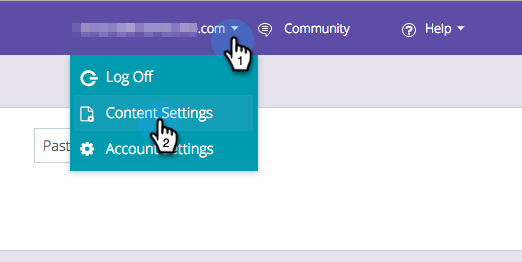

# Zieleinstellungen für Algorithmus {#algorithm-goal-settings}

Mit den Algorithmus-Zieleinstellungen können Sie das Endziel des Algorithmus für künstliche Intelligenz für prädiktive Inhalte festlegen, sodass er an Ihren Geschäftszielen ausgerichtet wird.

1. Klicken Sie unter Prädiktiver Inhalt auf Ihren Anmeldenamen und wählen Sie **[!UICONTROL Inhaltseinstellungen]**.

   

1. Wählen Sie unter Inhaltseinstellungen die Option **[!UICONTROL Algorithmus]** aus.

   

1. Wählen Sie ein Ziel für jede Quelle für prädiktiven Inhalt für den KI-Algorithmus aus, um die Leistung Ihres Inhalts zu maximieren.

   

   | **[!UICONTROL Klicks]** | Inhalt anzeigen, der die Person, die den Inhalt betrachtet, am ehesten dazu veranlasst, ihn anzuklicken |
   |---|---|
   | **[!UICONTROL Konversionen]** | Inhalt anzeigen, der die Person, die den Inhalt betrachtet, am ehesten dazu veranlasst, ein Formular auszufüllen |

1. Klicken Sie auf **[!UICONTROL Speichern]**, wenn Sie fertig sind.

   
