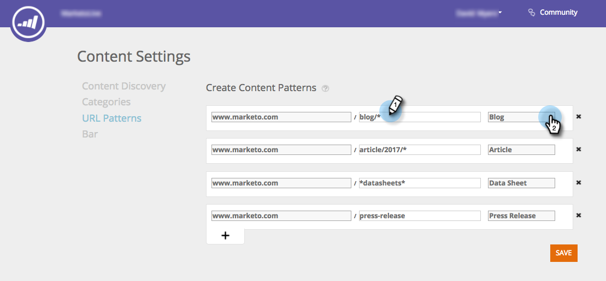

# Erstellen von Inhaltsmustern {#create-content-patterns}

Wenn Sie Inhaltsmuster festlegen, werden Inhalte automatisch erkannt, wenn ein Besucher auf die HTML-Webseite klickt, die für das Inhaltsmuster relevant ist. Es wird verwendet, um HTML-Seiten (Blog-Beiträge, Pressemitteilungen, News-Artikel) als Inhaltselemente zur Seite &quot;Alle Inhalte&quot;hinzuzufügen. Wenn die automatische Erkennung auf Inhaltsmustern basiert, werden HTML-Seiten entdeckt und verfolgt, die mit dem definierten URL-Muster in Zusammenhang stehen, wenn ein Web-Besucher eine Ansicht durchführt oder auf einen Link zur Seite klickt. Dieses Inhaltselement (URL, Seitenname und Metadaten einschließlich Bild-URL und Beschreibung) wird der Seite &quot;Alle Inhalte&quot;hinzugefügt, um prädiktiven Inhalt vorzubereiten. Für die automatische Erkennung anderer Inhalte, wie PDFs und eingebettetes Video, müssen Sie [die Inhaltserkennung aktivieren](/help/marketo/product-docs/predictive-content/getting-started/enable-content-discovery.md).

1. Gehen Sie zu **Inhaltseinstellungen**.

   

1. Klicken Sie auf **URL-Muster**.

   

1. Klicken Sie auf **+**, um eine Zeile zu öffnen, in der Sie Ihre Informationen eingeben können.

   

1. hinzufügen die URL-Erweiterung der Domäne, in der die Webseite vorhanden ist. Wählen Sie die Kategorie aus (z. B. Blog, Artikel, Datenblatt, Pressemitteilung).

   

   >[!NOTE]
   >
   >Elemente in der Dropdown-Liste auf der rechten Seite spiegeln die Kategorien wider, die Sie bei [erstellten Kategorien](/help/marketo/product-docs/predictive-content/getting-started/set-up-categories.md) eingerichtet haben.

1. Klicken Sie auf **+**, um einen weiteren Pfad hinzuzufügen.

   

1. hinzufügen Sie die Erweiterung und die Kategorie für den zusätzlichen Pfad und klicken Sie auf **Speichern**.

   

## Inhaltsmuster-Regeln {#content-pattern-rules}

* Sie können eine Platzhalterkarte an einer beliebigen Stelle in einem Ausdruck verwenden (Beispiel: _domain.com/*_, _domain.com/*blog*_)

* Es wird empfohlen, /* am Ende eines Ausdrucks zu verwenden, um die Mustererkennung fortzusetzen (Beispiel: _domain.com/blog/*_ erkennt alle Beiträge im Blog-Ordner)
* Bei Inhaltsmustern wird nicht zwischen Groß- und Kleinschreibung unterschieden (Beispiel: _domain.com/Blog/*_ findet alle HTML-Seiten auf _domain.com/Blog_ und _domain.com/blog_)

* URL-Parameter werden nicht erkannt (dies verhindert, dass mehrere Elemente mit derselben Inhalts-URL, aber unterschiedlichen Parametern erkannt werden)

## Beispiele {#examples}

Für _domain.com_:

<table> 
 <tbody> 
  <tr> 
   <th>URL-Muster</th> 
   <th>Ergebnis</th> 
  </tr> 
  <tr> 
   <td>blog/*</td> 
   <td>
Entdeckt alle Inhalte, die dem Muster domain.com/blog/ entsprechen:

domain.com/blog/5-top-tricks

domain.com/blog/2017/new-year-solutions

domain.com/Blog/3-best-recipes
</td> 
  </tr> 
  <tr> 
   <td>Artikel/2017/*</td> 
   <td>
Entdeckt alle Inhalte, die dem Muster domain.com/article/2017/ entsprechen:

domain.com/article/2017/5-top-tricks
</td> 
  </tr> 
  <tr> 
   <td></td> 
   <td>
Entdeckt alle URLs, die das Wort "Datasheets:"enthalten.

domain.com/datasheets/5-top-tricks

domain.com/blog/5-top-datasheets
</td> 
  </tr> 
  <tr> 
   <td>Pressemitteilung</td> 
   <td>
Es wird nur eine exakte Übereinstimmung mit der HTML-Seite gefunden:

domain.com/press-release
</td> 
  </tr> 
  <tr> 
   <td colspan="1"> </td> 
   <td colspan="1">
Wenn der URL-Ausdruck leer ist, erkennt das URL-Muster nur die Startseite:

domain.com
</td> 
  </tr> 
 </tbody> 
</table>
