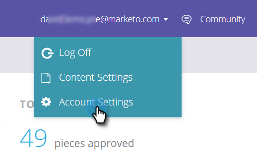

# Bereitstellen des JavaScript für Content-AI {#deploy-the-javascript-for-content-ai}

Um prädiktive Inhalte zu verwenden, müssen Sie das RTP-Tag (Web Personalization) generieren und einrichten.

## Tag generieren {#generate-tag}

1. Melden Sie sich bei Ihrem Predictive Content-Konto an. Navigieren Sie **Kontoeinstellungen**.

   

1. Suchen Sie **Domain-Konfiguration** die entsprechende Domain und klicken Sie auf **Tag generieren**.

   

1. Kopieren Sie das Web-Personalization-Tag und fügen Sie es in die HTML Ihrer Website ein.

   

   >[!NOTE]
   >
   >Kopieren Sie das Tag Web Personalization JavaScript und fügen Sie es als erstes Skript in die Kopfzeile Ihrer Seiten zwischen den `<head> </head>` Tags ein. Weitere Informationen finden Sie [Implementierungsanweisungen hier](/help/marketo/product-docs/web-personalization/rtp-tag-implementation/deploy-the-rtp-javascript.md).

1. Überprüfen Sie, ob das Tag auf allen Seiten angezeigt wird, einschließlich Landingpages und Subdomains. Überprüfen Sie dies, indem Sie mit der rechten Maustaste auf die Seite Ihrer Website klicken. Navigieren Sie **Seite Source anzeigen** in einem Webbrowser. Suche: „RTP“.

1. Bestätigen Sie, dass der Umschalter Tag auf **EIN** eingestellt ist.
