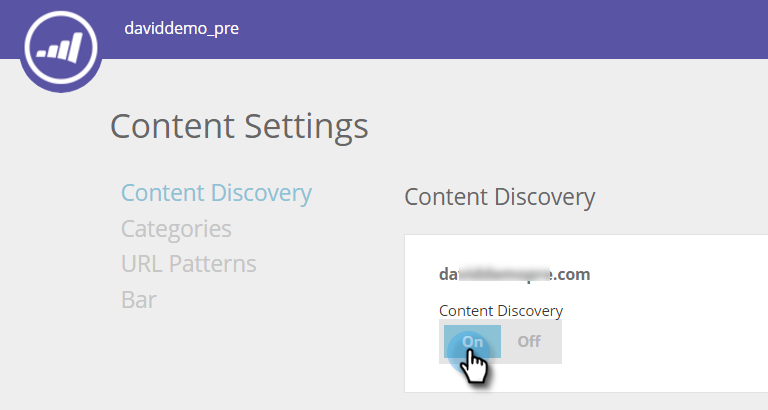

# Aktivieren der Inhaltsentdeckung {#enable-content-discovery}

Die Content Discovery-Funktion erkennt und kennzeichnet automatisch vorhandene Inhalte (einschließlich Fallstudien, Blog-Posts, Videos, Pressemitteilungen usw.) von Ihrer Website aus und verfolgt die Anzahl der Aufrufe dieser Materialien.  Prädiktive Inhalte verwenden die erkannten Inhalte und verwenden prädiktive Analysen, um zu ermitteln, welcher Inhalt Ihre leistungsstärksten Inhalte sind, und empfehlen der richtigen Person die besten Inhalte.

1. Navigieren Sie **[!UICONTROL Inhaltseinstellungen]**.

   

1. Schalten Sie [!UICONTROL Inhaltssuche] auf **[!UICONTROL Ein]**.

   

Wenn Sie [!UICONTROL Inhaltssuche] auf [!UICONTROL Ein] setzen, werden PDF- oder Videoinhalte automatisch erkannt, wenn ein Web-Besucher auf die Datei klickt oder das Video ansieht. Dieses Inhaltselement (URL, Inhaltsname und Bild-URL) wird hinzugefügt und dann unter der Seite Alle Inhalte nachverfolgt. Beim automatischen Erkennen von Videos erkennen wir ein Video, wenn ein Web-Besucher auf ein eingebettetes Video aus YouTube, [!DNL Vimeo] oder [!DNL Wistia] klickt und es sich ansieht. Für die automatische Erkennung anderer Inhalte müssten Sie [Inhaltsmuster erstellen](/help/marketo/product-docs/predictive-content/getting-started/create-content-patterns.md).
