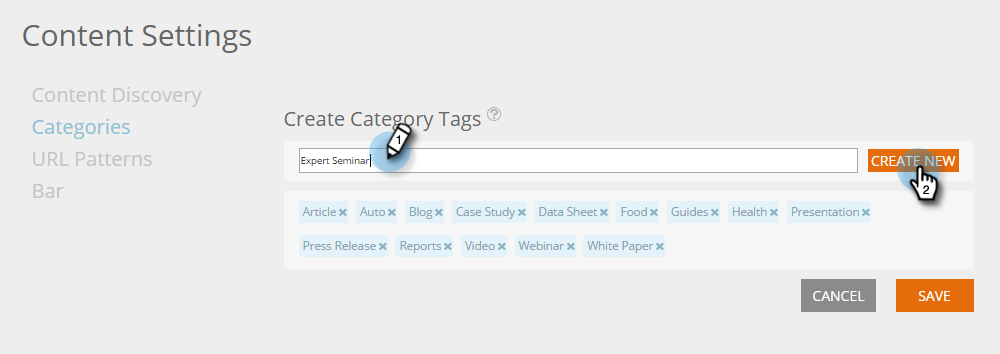

# Kategorien einrichten {#set-up-categories}

Erstellen Sie Kategorien in prädiktiven Inhalten, um Ihre prädiktiven Ergebnisse im Web oder in E-Mails zu gruppieren. Sie können beispielsweise nur mit Blogs oder mit Inhalten in einer bestimmten Sprache arbeiten. Außerdem können Sie damit Ihre Seitenansicht durchsuchen und filtern.  Kategorien werden auf den Seiten „Alle Inhalte“ und „Prädiktiver Inhalt“ angezeigt.

Wenn Sie erkannte Inhalte bearbeiten, fügen Sie Kategorien im Bearbeitungsbildschirm hinzu. Klicken Sie auf **Kategorien** und wählen Sie diese aus der Dropdown-Liste aus.

Wenn Sie Inhalte hinzufügen, können Sie sie mit Kategorien taggen, die im Popup-Fenster ausgewählt werden.

## Kategorie-Tags erstellen {#create-category-tags}

So erstellen Sie Kategorie-Tags.

1. Navigieren Sie **Inhaltseinstellungen**.

   

1. Klicken Sie auf **Kategorien**.

   

1. Vorhandene Kategorie-Tags werden angezeigt. Geben Sie ein neues Kategorie-Tag ein und klicken Sie auf **Neu erstellen**.

   

1. Sie können ein Kategorie-Tag entfernen, indem Sie auf das **x** daneben klicken.

   

1. Klicken **abschließend** Speichern“.

   

   Ziemlich einfach.
