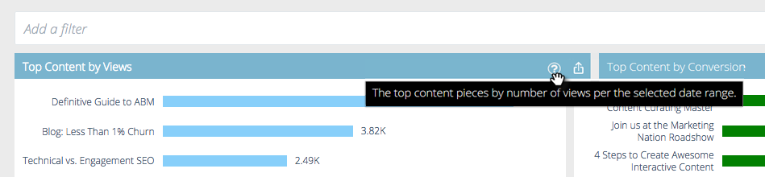
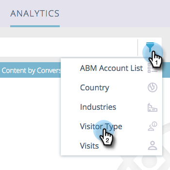

# Prädiktive Inhaltsanalyse – Überblick {#predictive-content-analytics-overview}

Verwenden Sie die Inhaltsanalyse, um weitere Einblicke in Ihre vorhandenen Inhalte zu erhalten, zu erfahren (basierend auf KI und prädiktiven Algorithmen), welche Inhalte für Ihre Zielgruppen funktionieren, und den ROI Ihrer Marketing-Maßnahmen zu steigern.

>[!NOTE]
>
>Die [!UICONTROL Analytics]-Registerkarte und Inhaltsanalysefunktionen sind ausschließlich mit prädiktiven Inhalten von Marketo verfügbar.

## Überblick {#overview}

Klicken Sie auf der Zusammenfassungsseite auf **[!UICONTROL Analytics]**.

[!UICONTROL Analytics] umfasst mehrere Abschnitte: [!UICONTROL Top-Inhalte nach ], [!UICONTROL Top-Inhalte nach Konversionsrate], [!UICONTROL Trending-Inhalte] [!UICONTROL Vorgeschlagene Inhalte] und [!UICONTROL Inhalte].

Zeigen Sie mit der Maus auf das Fragezeichen in der Kopfzeile eines Abschnitts, um weitere Details anzuzeigen.

Klicken Sie auf die Schaltfläche Exportieren , um die Ergebnisse dieses Abschnitts über Excel zu exportieren.

Sie können die Ergebnisse nach verschiedenen Attributen/Eigenschaften filtern (z. B[!UICONTROL  „ABM-]&quot;, [!UICONTROL Land] usw.).

Klicken Sie auf das Kalendersymbol, um die Daten der wiedergegebenen Daten zu ändern. Wählen Sie einen voreingestellten Zeitraum oder einen bestimmten Datumsbereich aus.

## [!UICONTROL Top-Inhalte nach Ansichten] {#top-content-by-views}

Zeigt die obersten Inhaltselemente nach Anzahl der Ansichten pro ausgewähltem Datumsbereich an.

## [!UICONTROL Top-Inhalte nach Konversionsrate] {#top-content-by-conversion-rate}

Zeigt die Top-Konvertierungsinhalte nach Konversionsrate für den ausgewählten Datumsbereich an.

>[!NOTE]
>
>**Definition**
>
>**Konversionsrate** Ein Prozentsatz, der durch direkte Konversionen dividiert durch Klicks berechnet wird.

## [!UICONTROL Trending Content] {#trending-content}

Zeigt den Popularitätszuwachs eines Inhaltselements an, indem Sie sich den Anstieg der Ansichten in den letzten zwei Wochen im Vergleich zum gleichen vorherigen Zeitraum ansehen.

## [!UICONTROL Vorgeschlagener Inhalt] {#suggested-content}

Zeigt Inhalte an, die basierend auf dem von Ihnen definierten Filter in Ihren Marketing-Aktivitäten beworben werden sollten.

Bewegen Sie den Mauszeiger über ein Bild in den vorgeschlagenen Inhalten, um die verfügbaren Optionen anzuzeigen.

>[!NOTE]
>
>Sehen Sie diese Symbole unten? Von links nach rechts: [!UICONTROL Inhalt anzeigen], [!UICONTROL In CSV exportieren], [!UICONTROL Inhalt genehmigen].

## [!UICONTROL Inhalt] {#content}

Suchen Sie nach dem gewünschten Inhaltselement und klicken Sie darauf, um weitere Details anzuzeigen, darunter: die Besucher, die es anzeigen, neu gegenüber wiederkehrend, bekannt und anonym, die wichtigsten Orte, von denen die Besucher beim Anzeigen des Inhalts kamen, und die wichtigsten abgeleiteten Branchen, aus denen sie stammen.

>[!NOTE]
>
>Ähnlicher Inhalt basiert auf den ausgewählten Inhalten und wird mithilfe eines Zuordnungsregel-Algorithmus berechnet. Die Ergebnisse stellen Inhaltselemente dar, auf die Besucher je nach ausgewähltem Element und früherem Besucherverhalten höchstwahrscheinlich klicken. Dabei werden weder Filter noch Zeitraum berücksichtigt.
