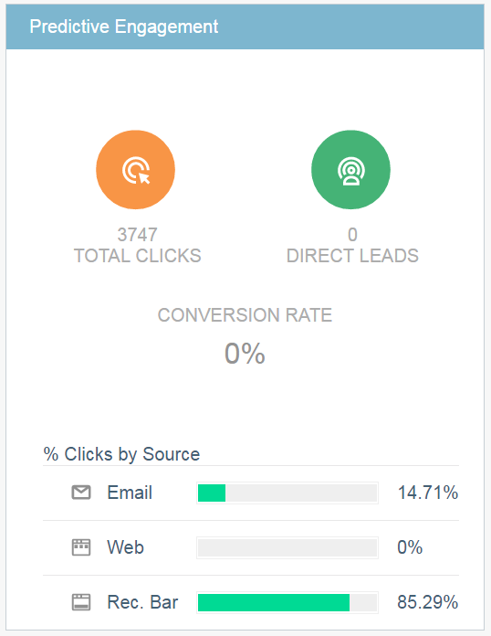

# Die Zusammenfassung der prädiktiven Inhalte {#the-predictive-content-summary}

Die Zusammenfassung des prädiktiven Inhalts zeigt auf einen Blick die Informationen an, die Sie über Ihren prädiktiven Inhalt benötigen - mit Tabellen, Diagrammen und aktuellen Zahlen.

## Obere Leiste {#top-bar}

In der oberen Leiste werden die aktuellen Zahlen für Inhalte und Ansichten sowie die Anzahl der aktivierten Elemente angezeigt. Wählen Sie oben rechts eine Ansicht der letzten 7 oder 30 Tage für die gesamte Seite aus.

## Leistungstabelle {#performance-table}

Hier sehen Sie Ihre 10 wichtigsten entdeckten Inhalte, einschließlich Ansichten, direkten Leads und Konversionsraten.

## [!UICONTROL Predictive Engagement] {#predictive-engagement}

Vergleichen Sie Ihre Konversionsrate durch Vergleich der Gesamtklicks und der direkten Leads und durch Vergleich der Leistung der verschiedenen Quellen.

## [!UICONTROL Inhaltstrend nach Ansichten]  {#content-trend-by-views}

Vergleichen Sie, wie Ihre Ansichten aller Inhalte mit Ihren prädiktiven Inhalten übereinstimmen.

## [!UICONTROL Top-Kategorien nach Interaktion] {#top-categories-by-engagement}

Welche Inhaltskategorien sind am ansprechendsten? Sehen Sie es in diesem Diagramm.

>[!NOTE]
>
>Wenn Sie auf einen Kategorie-Link klicken (Beispiele in der obigen Abbildung: LeadGen, E-Mail usw.) Die Seite Alle Inhalte mit der Kategorie, auf die Sie geklickt haben, wird zum Filter hinzugefügt und die Inhaltsanalysen in dieser Kategorie werden angezeigt.
