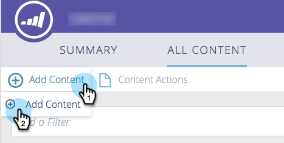
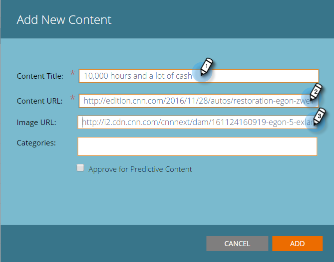
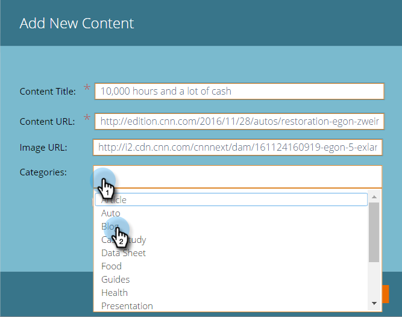
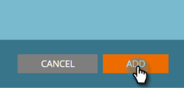
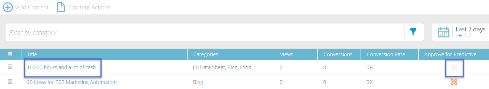

# Hinzufügen von neuen Inhalten {#add-new-content}

Sie können der Seite „Alle Inhalte“ [!UICONTROL  Inhalt ] hinzufügen.

1. Klicken Sie auf **[!UICONTROL Inhalt hinzufügen]** und wählen Sie **[!UICONTROL Inhalt hinzufügen]** aus.

   

1. Geben Sie einen Titel und eine URL sowie ggf. eine Bild-URL ein.

   

1. Um Kategorien hinzuzufügen, klicken Sie auf das Feld und wählen Sie aus der Dropdown-Liste aus.

   

1. Klicken Sie auf **[!UICONTROL Hinzufügen]**.

   

1. Der neue Titel wird jetzt auf der Seite **[!UICONTROL Alle Inhalte]** angezeigt. Beachten Sie, dass es noch nicht für prädiktive Inhalte genehmigt ist.

   

1. So fügen Sie es zu „Prädiktiver [&quot; ](/help/marketo/product-docs/predictive-content/working-with-all-content/approve-a-title-for-predictive-content.md).
