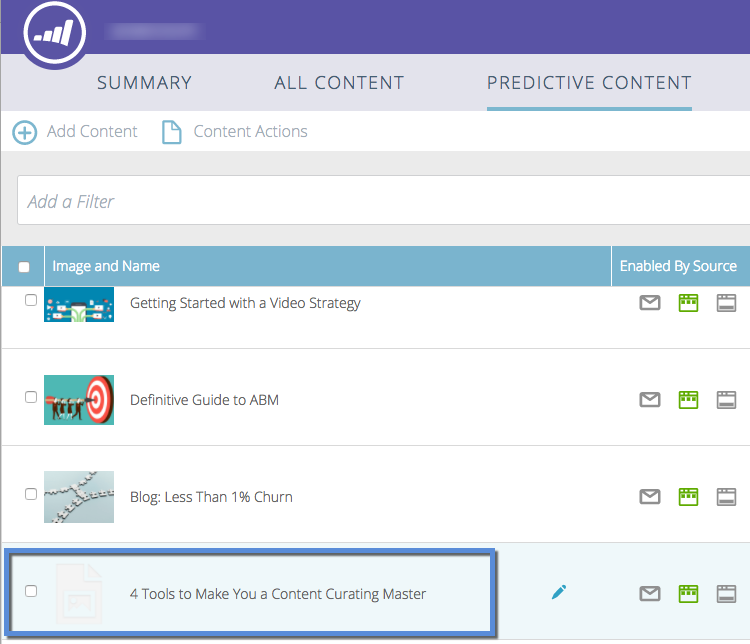

# Genehmigen eines Titels für prädiktive Inhalte {#approve-a-title-for-predictive-content}

Sie können einen beliebigen Titel auf der Seite [!UICONTROL Alle Inhalte] zu prädiktiven Inhalten hinzufügen, indem Sie ihn auf der Seite [!UICONTROL Alle Inhalte] oder im Popup [!UICONTROL Inhalt bearbeiten] genehmigen.

## [!UICONTROL Alle Inhalte] Seite {#all-content-page}

1. Aktivieren Sie das Kontrollkästchen neben dem Inhalt.

   

1. Klicken Sie auf **[!UICONTROL Inhaltsaktionen]** und wählen Sie **[!UICONTROL Für prädiktiven Inhalt genehmigen]** aus.

   

## [!UICONTROL Inhalt bearbeiten] Popup {#edit-content-pop-up}

Sie können Titel für prädiktive Inhalte auch direkt im Popup [!UICONTROL Inhalt bearbeiten] genehmigen.

1. Bewegen Sie den Mauszeiger über ein Inhaltselement und klicken Sie auf das Bearbeitungssymbol am Ende der Zeile.

   

1. Aktivieren Sie das **[!UICONTROL Für prädiktiven Inhalt genehmigen]** im Popup [!UICONTROL Inhalt bearbeiten] und klicken Sie auf **[!UICONTROL Speichern]**.

   

Unabhängig davon, welche Methode Sie verwenden[!UICONTROL &#x200B; wird das Symbol „Für prädiktiven Inhalt &#x200B;]&quot; jetzt in der Zeile angezeigt.

Jetzt können Sie den Titel auf der Seite &quot;[!UICONTROL &quot; &#x200B;] sehen.

