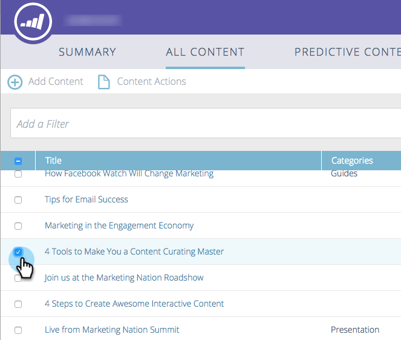

# Löschen von Inhalten {#delete-content}

Wenn Sie ein Stück Inhalt nicht mehr benötigen, ist es einfach, es loszuwerden.

1. Aktivieren Sie das Kontrollkästchen neben dem Inhaltselement, das Sie entfernen möchten.

   

1. Klicken Sie auf die **[!UICONTROL Inhaltsaktionen]** und wählen Sie **[!UICONTROL Inhalt löschen]** aus.

   
