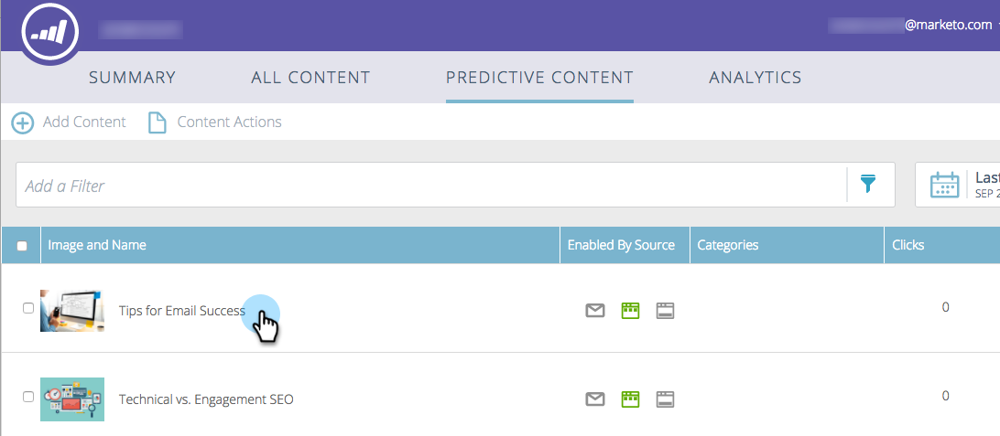
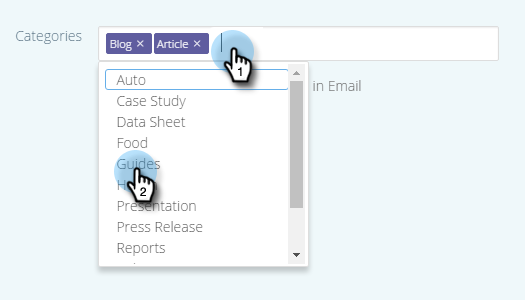

# Bearbeiten prädiktiver Inhalte für E-Mails {#edit-predictive-content-for-emails}

So richten Sie Ihre prädiktiven Inhalte für E-Mails ein.

>[!PREREQUISITES]
>
>Inhalte müssen auf [ Seite „Alle Inhalte](/help/marketo/product-docs/predictive-content/working-with-all-content/approve-a-title-for-predictive-content.md) [!UICONTROL &#x200B; für prädiktive Inhalte genehmigt &#x200B;].

1. Klicken Sie auf der [!UICONTROL Prädiktiver Inhalt]-Seite auf einen Titel, um den Editor zu öffnen.

   

1. Die Seite „Bearbeiten“ wird geöffnet. **[!UICONTROL E-Mail]** wird standardmäßig angezeigt.

   

   >[!NOTE]
   >
   >Titel und URL sind bereits ausgefüllt. Vergewissern Sie sich, dass sie das sind, was Sie wollen.

1. Um die Schaltflächenbeschriftung hinzuzufügen bzw. zu bearbeiten, geben Sie in das Textfeld rechts daneben ein.

   

   >[!NOTE]
   >
   >Wenn Sie die Schaltflächenbeschriftung geändert haben, wird sie aktualisiert, wenn Sie Ihre Änderungen speichern oder eine Vorschau des Bildes anzeigen.

1. Um die Bild-URL hinzuzufügen oder zu bearbeiten, klicken Sie auf **[!UICONTROL Bild bearbeiten]**.

   

   >[!CAUTION]
   >
   >Um die beste Qualität zu gewährleisten, muss Ihr Bild 400x400 Pixel oder kleiner sein.

1. Fügen Sie die Bild-URL ein und klicken Sie auf **[!UICONTROL Hinzufügen]**.

   

1. Klicken und ziehen Sie den Schieberegler, um die Bildgröße zu ändern. Klicken und ziehen Sie dann das Zuschnittsfeld, um den gewünschten Bildbereich zu isolieren. Klicken Sie **[!UICONTROL Vorschau]** wenn Sie fertig sind.

   

1. Klicken Sie auf die Pfeile an den Seiten, um einen Bildlauf durchzuführen und Ihren Inhalt in jeder der E-Mail-Layout-Vorschauen anzuzeigen (zwei Optionen werden angezeigt).

   |  |  |
   |---|---|

1. Klicken Sie optional auf das Feld **[!UICONTROL Kategorien]** und fügen Sie dem Inhalt Kategorien hinzu. Die Optionen stammen aus den [Kategorien, die Sie bereits eingerichtet haben](/help/marketo/product-docs/predictive-content/getting-started/set-up-categories.md).

   

1. Aktivieren Sie das Kontrollkästchen, um Prognoseinhalte in E-Mails zu aktivieren.

   

1. Klicken Sie auf **[!UICONTROL Speichern]**.

   

   >[!NOTE]
   >
   >In Marketo Email Editor v2.0 können Sie auch [Layoutvorlagen anzeigen](/help/marketo/product-docs/predictive-content/enabling-predictive-content/enable-predictive-content-in-emails.md) die Sie verwenden, während Sie den Inhalt aktivieren.
