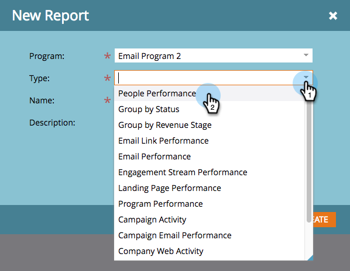

# Erstellen eines Berichts in einem Programm {#create-a-report-in-a-program}

Führen Sie einen Bericht aus, um Personen, Ihre Programme, Landingpages, E-Mails und soziale Assets zu analysieren.

1. Navigieren Sie zu **Marketingaktivitäten**.

   

1. Wählen Sie ein Programm.

   

   >[!NOTE]
   >
   >Sie können Berichte auch über die **Analytics** Registerkarte.

1. Klicken Sie mit der rechten Maustaste auf das Programm und wählen Sie **Neues lokales Asset**.

   

1. Klicks **Bericht**.

   

1. Berichtauswahl **Typ**.

   

   >[!TIP]
   >
   >Siehe [Berichtstyp - Übersicht](https://docs.marketo.com/display/DOCS/Report+Type+Overview) für eine kurze Beschreibung jedes einzelnen.

1. Benennen Sie Ihren Bericht.

   

   >[!TIP]
   >
   >Um die Navigation in Ihren Berichten zu einem späteren Zeitpunkt zu vereinfachen, fügen Sie im Namen einen Verweis auf den Berichtstyp ein.

1. Legen Sie den Zeitrahmen für Ihren Bericht fest. Siehe [Berichtszeitrahmen ändern](/help/marketo/product-docs/reporting/basic-reporting/editing-reports/change-a-report-time-frame.md) für weitere Details.

1. Klicken Sie auf **Bericht** um Ihre Statistiken anzuzeigen.

   

   >[!NOTE]
   >
   >Standardmäßig decken Berichte alle Aktivitäten Ihres Kontos über verschiedene Programme hinweg ab.

   >[!NOTE]
   >
   >Sie können schnell viele Berichte bekommen. Denken Sie daran, [Bericht löschen](/help/marketo/product-docs/reporting/basic-reporting/report-activity/delete-a-report.md) benötigen Sie nicht mehr.

   >[!MORELIKETHIS]
   >
   >Sie können [Berichtszeitrahmen ändern](/help/marketo/product-docs/reporting/basic-reporting/editing-reports/change-a-report-time-frame.md), [Basisbericht abonnieren](/help/marketo/product-docs/reporting/basic-reporting/report-subscriptions/subscribe-to-a-basic-report.md), [einen Bericht in Excel exportieren](/help/marketo/product-docs/reporting/basic-reporting/report-activity/export-a-report-to-excel.md), [Personen in einem Bericht mit einer intelligenten Liste filtern](/help/marketo/product-docs/reporting/basic-reporting/editing-reports/filter-people-in-a-report-with-a-smart-list.md)und mehr.
