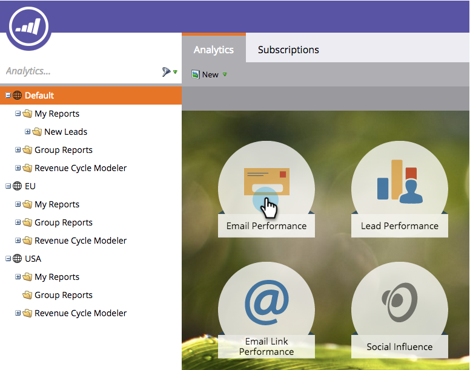

# Navigieren zur Analytics-Startseite {#navigating-the-analytics-home-page}

1. Wechseln Sie zum Bereich **Analytics** .

1. 

1. Wählen Sie einen [Berichtstyp](/help/marketo/product-docs/reporting/basic-reporting/report-types/report-type-overview.md) aus.

1. 

1. Klicken Sie nach Ausführung des Berichts auf den Arbeitsbereich, um zur **Analytics-Startseite** zurückzukehren.

   

   Sehr gut! Sie wissen, wie Sie durch die Analytics-Startseite navigieren!

>[!MORELIKETHIS]
>
>[Verstehen meiner Berichte und Gruppenberichte](/help/marketo/product-docs/reporting/basic-reporting/creating-reports/understanding-my-reports-and-group-reports.md)
