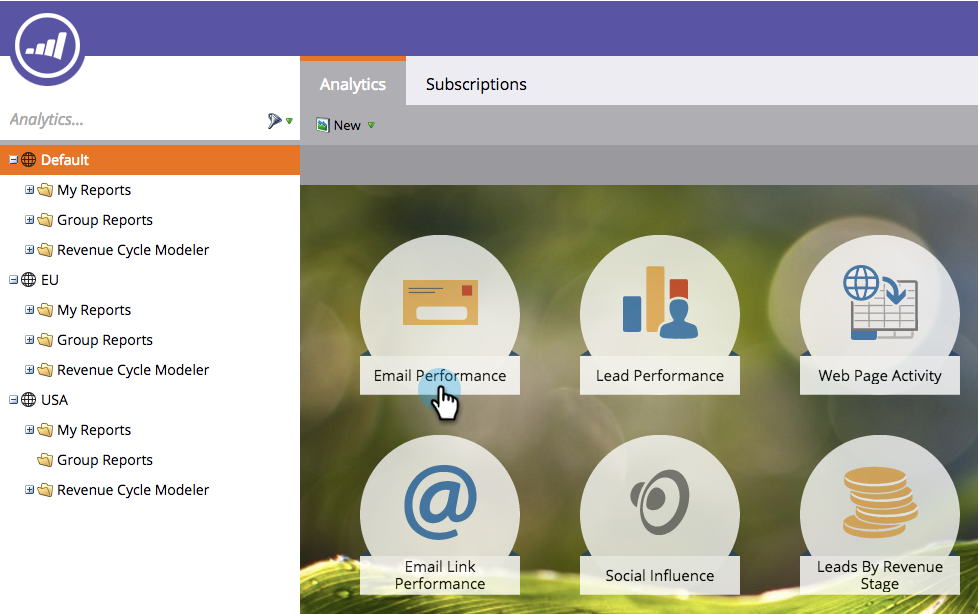

# Speichern eines Berichts {#save-a-report}

Manchmal muss ein Standardbericht gespeichert werden, damit er später erneut angezeigt werden kann. So geht das:

1. Wechseln Sie zum Bereich **[!UICONTROL Analytics]**.

   

1. Wählen Sie einen [Berichtstyp](/help/marketo/product-docs/reporting/basic-reporting/report-types/report-type-overview.md).

   

1. Klicken Sie **[!UICONTROL Berichtsaktionen]** und wählen Sie **[!UICONTROL Speichern unter]**.

   

1. **[!UICONTROL Speichern unter]** einen Speicherort und wählen Sie einen **[!UICONTROL Ordner]** aus.

   

1. **[!UICONTROL Name]** den Bericht und klicken Sie auf **[!UICONTROL Speichern]**.

   

   Cool! Der gespeicherte Bericht wird jetzt in der Baumstruktur angezeigt.

   

>[!MORELIKETHIS]
>
>Erfahren Sie, wie [einen Bericht klonen, um Berichte zu gruppieren](/help/marketo/product-docs/reporting/basic-reporting/report-activity/clone-a-report-to-group-reports.md).
