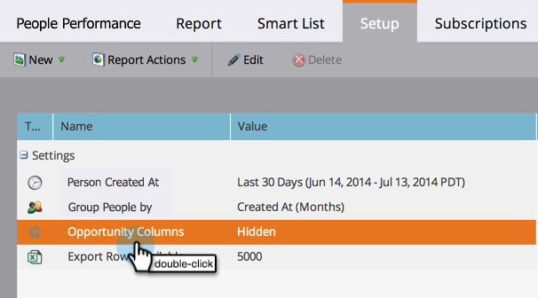

# Hinzufügen von Opportunity-Spalten zu einem Lead-Bericht {#add-opportunity-columns-to-a-lead-report}

Um die Statistiken zu Opportunitys in Ihren Personenberichten anzuzeigen, können Sie Opportunity-Spalten hinzufügen.

1. Navigieren Sie zum Bereich **[!UICONTROL Marketing-Aktivitäten]**.

   

1. Wählen Sie Ihren Bericht im Navigationsbaum aus und klicken Sie auf die Registerkarte **[!UICONTROL Setup]**.

   

1. Doppelklicken Sie auf **[!UICONTROL Opportunity-Spalten]**.

   

1. Wählen **[!UICONTROL aus]** Dropdown-Menü aus.

   

1. Klicken Sie auf **[!UICONTROL Bericht]**, um Ihren Bericht mit Opportunity-Metriken anzuzeigen.

   

   >[!TIP]
   >
   >Scrollen Sie nach rechts, um weitere Spalten anzuzeigen.

1. Um Spalten [ oder aus dem Bericht zu entfernen](/help/marketo/product-docs/reporting/basic-reporting/editing-reports/select-report-columns.md) klicken Sie auf eine beliebige Spaltenüberschrift und wählen Sie **[!UICONTROL Spalten]** aus.

   

   Die verfügbaren Opportunity-Spalten sind:

   >[!NOTE]
   >
   >Jede Opportunity wird nur einmal gezählt, basierend auf dem ihr zugewiesenen primären Kontakt.

   | Spalte | Beschreibung |
   |---|---|
   | [!UICONTROL Keine Opportunity] | Anzahl der Personen, die *kein* Opportunity-Kontakt sind. |
   | [!UICONTROL Tage ohne Opportunity] | Durchschnittsalter (in Tagen) der Personen, die *kein* sind. |
   | [!UICONTROL Hat Gelegenheit] | Anzahl der Personen, die ein primärer Opportunity-Kontakt sind. |
   | [!UICONTROL Hat Opportunity %] | Prozentsatz der Personen, die ein primärer Opportunity-Kontakt sind. |
   | [!UICONTROL Tage bis Opportunity] | Durchschnittliche Anzahl der Tage für die Konversion von der Person zum primären Opportunity-Kontakt. |
   | [!UICONTROL Opportunity-Gesamtbetrag] | Summe aller Opportunity-Beträge. |
   | [!UICONTROL Durchschn. Opportunity-Betrag] | Summe der Opportunity-Beträge, geteilt durch die Anzahl der Opportunities. |
   | [!UICONTROL Opportunity insgesamt] | Anzahl aller Gelegenheiten. |
   | [!UICONTROL Geschlossen] | Anzahl der Opportunitys, die geschlossen, gewonnen oder verloren wurden. |
   | [!UICONTROL Gewonnen] | Anzahl der gewonnenen Gelegenheiten. |
   | [!UICONTROL % gewonnen] | Prozentsatz der gewonnenen Gelegenheiten. |
   | [!UICONTROL Gesamtgewinn] | Summe der gewonnenen Opportunity-Beträge. |
   | [!UICONTROL Tage bis Schließen] | Durchschnittliche Anzahl der Tage bis zum Schließen der Opportunities. |
   | [!UICONTROL Tage im Verkauf] | Durchschnittliche Dauer des Verkaufszyklus (Tage bis zur Opportunity + Tage bis zum Abschluss). |

   >[!MORELIKETHIS]
   >
   >Erfahren Sie, wie [die Größe Ihres Berichts verwalten](/help/marketo/product-docs/reporting/basic-reporting/editing-reports/configure-report-size.md).
