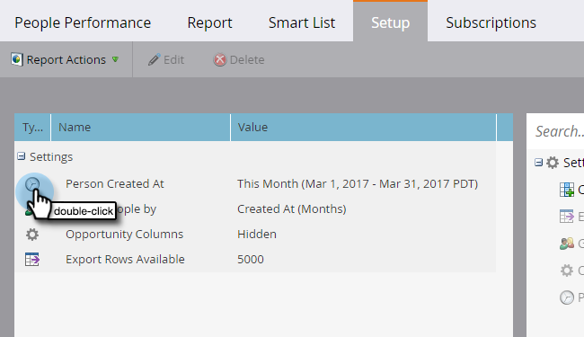
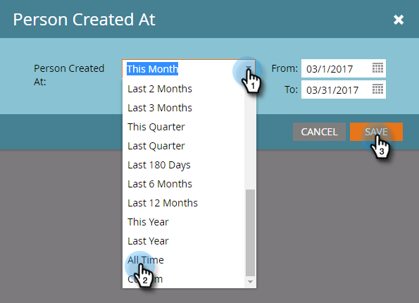

# Ändern des Berichtszeitrahmens {#change-a-report-time-frame}

Ändern Sie den von Ihrem Bericht abgedeckten Zeitraum, um sich auf einen bestimmten Zeitpunkt der Aktivität zu konzentrieren.

1. Navigieren Sie zum Bereich **[!UICONTROL Marketing]** (oder **[!UICONTROL Analytics]**).

   

1. Wählen Sie Ihren Bericht im Navigationsbaum aus und klicken Sie auf die Registerkarte **[!UICONTROL Setup]**.

   

1. Doppelklicken Sie auf das Zeitrahmen-Feld, dessen Beschriftung je nach Berichtstyp unterschiedlich ist:

   * **[!UICONTROL Person erstellt um]**, in Personenberichten
   * **[!UICONTROL Sendedatum]** in E-Mail-Berichten
   * **[!UICONTROL Datum der Aktivität]** in allen anderen Berichten

   

   >[!NOTE]
   >
   >**[!UICONTROL Person erstellt in]** bezieht sich auf den Zeitpunkt, zu dem die Person in Ihrer Datenbank bekannt wurde.

1. Wählen Sie den entsprechenden Zeitrahmen aus dem Dropdown-Menü aus.

   

   >[!TIP]
   >
   >Um bestimmte Datumswerte festzulegen, wählen **[!UICONTROL Benutzerdefiniert]** aus dem Dropdown-Menü aus und geben Sie die Daten in die **[!UICONTROL Von]** und **[!UICONTROL Bis]** Kalenderfelder ein.

   Klicken Sie auf **[!UICONTROL Bericht]**, um den Bericht für den ausgewählten Zeitraum anzuzeigen.
   

   >[!MORELIKETHIS]
   >
   >Um Ihren Bericht nach bestimmten Personenattributen einzugrenzen, können Sie [Personen in einem Bericht mit einer Smart-Liste filtern](/help/marketo/product-docs/reporting/basic-reporting/editing-reports/filter-people-in-a-report-with-a-smart-list.md).
