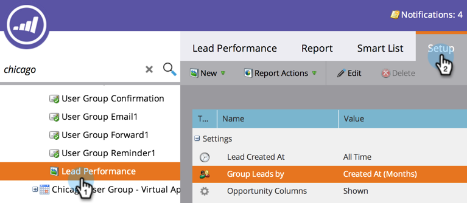

# Berichtsgröße konfigurieren {#configure-report-size}

Standardmäßig sind Marketo-Berichte auf maximal 5.000 Zeilen beschränkt, aber Sie können diese Beschränkung ändern.

1. Navigieren Sie zum Bereich **[!UICONTROL Marketing]** Aktivitäten.

   

1. Wählen Sie Ihren Bericht im Navigationsbaum aus und klicken Sie auf die Registerkarte **[!UICONTROL Setup]**.

   

1. Doppelklicken Sie auf **[!UICONTROL Zeilen exportieren verfügbar]**.

   

1. Wählen Sie das neue Limit aus.

   

   >[!TIP]
   >
   >Durch die Änderung des Limits wird nicht nur die exportierte [!DNL Excel]-Datei, sondern auch die Berichtsgröße selbst geändert. Wenn die Generierung Ihres Berichts also zu lange dauert, reduzieren Sie das Limit!

1. Klicken Sie **[!UICONTROL Speichern]**, um das neue Limit zu bestätigen.

   

   Du bist fertig! Der Bericht wird die neue Grenze einhalten.

   >[!MORELIKETHIS]
   >
   >Sie können [Ihren Bericht exportieren](/help/marketo/product-docs/reporting/basic-reporting/report-activity/export-a-report-to-excel.md) mit dem neuen Limit.
