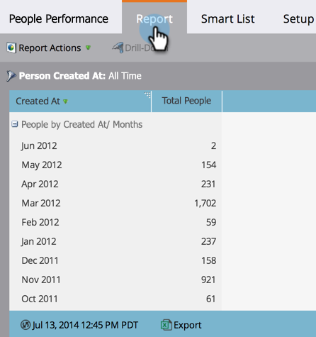

# Filtern von Personen in einem Bericht mit einer intelligenten Liste {#filter-people-in-a-report-with-a-smart-list}

Verwenden Sie Smart Lists, um Ihre Berichte nach bestimmten Personenattributen zu filtern.

Sie können Smart Lists mit den folgenden Berichtstypen verwenden:

* [Leistung (Personen)](/help/marketo/product-docs/reporting/basic-reporting/report-types/people-performance-report.md)
* [Personen nach Status](/help/marketo/product-docs/reporting/basic-reporting/report-types/people-by-status-report.md)
* [E-Mail-Leistung](/help/marketo/product-docs/email-marketing/email-programs/email-program-data/email-performance-report.md)
* [E-Mail-Link-Leistung](/help/marketo/product-docs/email-marketing/email-programs/email-program-data/email-link-performance-report.md)
* [Engagement-Stream Performance](/help/marketo/product-docs/email-marketing/drip-nurturing/reports-and-notifications/engagement-stream-performance-report.md)
* [Kampagnen-E-Mail-Leistung](/help/marketo/product-docs/reporting/basic-reporting/report-types/campaign-email-performance-report.md)
* [Unternehmens-Web-Aktivität](/help/marketo/product-docs/reporting/basic-reporting/report-types/company-web-activity-report.md)
* [Webseitenaktivität](/help/marketo/product-docs/reporting/basic-reporting/report-types/web-page-activity-report.md)

1. Navigieren Sie zum Bereich **[!UICONTROL Marketing-Aktivitäten]**.

   

1. Wählen Sie Ihren Bericht im Navigationsbaum aus und klicken Sie auf die Registerkarte **[!UICONTROL Smart-Liste]**.

   

1. Finden Sie den entsprechenden Filter und ziehen Sie ihn hinüber.

   

1. Konfigurieren Sie den Filter.

   

1. Klicken Sie auf **[!UICONTROL Bericht]**, um Ihren gefilterten Bericht anzuzeigen.

   

   Sehr gut! Jetzt zeigt Ihr Bericht nur noch die Daten für die Personen an, die der Smart-Liste entsprechen.
