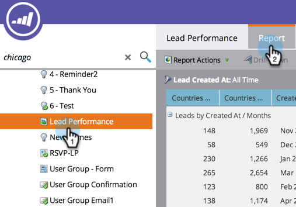

# Berichtsspalten neu anordnen {#reorder-report-columns}

Sie können die Reihenfolge der Spalten in einem Bericht ändern.

1. Navigieren Sie zum Bereich **Marketing** (oder **Analytics**).

   

1. Wählen Sie in der Navigationsstruktur Ihren Bericht aus und klicken Sie auf die Registerkarte **Bericht**.

   

1. Klicken Sie auf die Spalte, halten Sie sie gedrückt, um sie an die neue Position zu ziehen, und lassen Sie dann die Maustaste los.

   

1. Das ist alles! Die Spalten werden jetzt in der neuen Reihenfolge angezeigt.

   

   Sie können diese Schritte wiederholen, bis die Spalten in der für Sie am besten geeigneten Reihenfolge angezeigt werden.

   >[!MORELIKETHIS]
   >
   >[Berichtsspalten auswählen](/help/marketo/product-docs/reporting/basic-reporting/editing-reports/select-report-columns.md)
