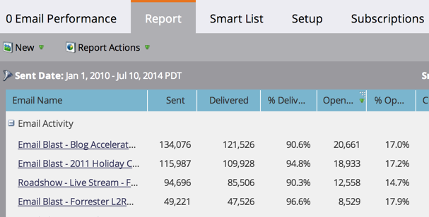

# Bericht zu Spalten sortieren {#sort-report-on-columns}

Sortieren Sie mithilfe von Spalten die Daten in Ihrem Bericht und machen Sie die wichtigsten Zahlen leicht auffindbar.

1. Navigieren Sie **[!UICONTROL Analytics]** (oder **[!UICONTROL Marketing-Aktivitäten]**).

   

1. Wählen Sie in der Navigationsstruktur Ihren Bericht aus und klicken Sie auf die Registerkarte **[!UICONTROL Bericht]**.

   

1. Klicken Sie auf die wichtigste Spalte und wählen Sie eine Sortierreihenfolge aus.

   

1. Sehr gut! Jetzt können Sie sich auf die interessantesten Daten in Ihrem Bericht konzentrieren.

   

   >[!MORELIKETHIS]
   >
   >[Berichtsspalten auswählen](/help/marketo/product-docs/reporting/basic-reporting/editing-reports/select-report-columns.md)
