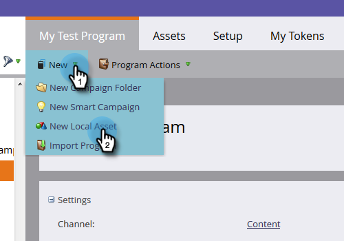
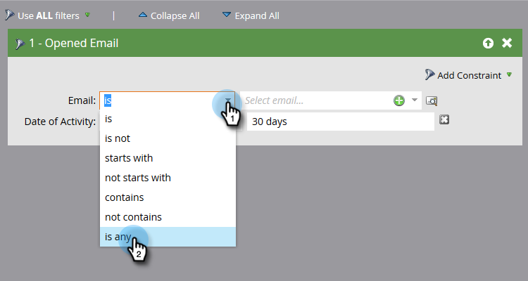
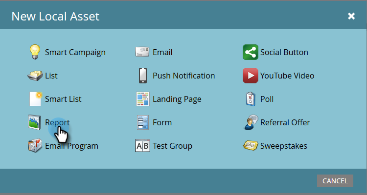
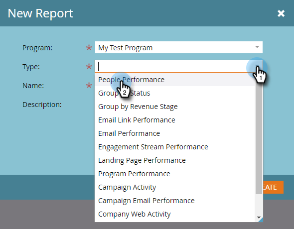
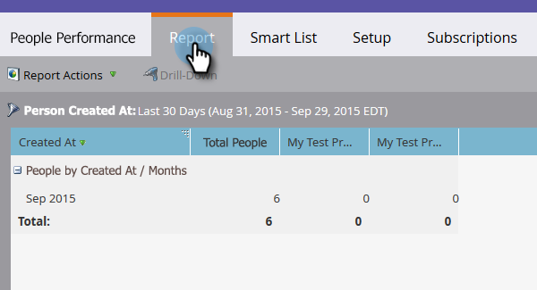

# Erstellen eines Personenleistungsberichts mit Mobile Platform-Spalten {#build-a-people-performance-report-with-mobile-platform-columns}

Führen Sie diese Schritte aus, um einen Bericht zur Leistung für Personen mit mobilen Plattformen (iOS/Android) zu erstellen.

## Erstellen mobiler Smart-Listen {#create-mobile-smart-lists}

1. Wechseln Sie zu **Marketingaktivitäten**.

   

1. Wählen Sie ein Programm.

   

1. Wählen Sie unter &quot;**Neu**&quot;die Option &quot;**Neues lokales Asset**&quot;.

   

1. Klicken Sie auf **Smart List**.

   

1. Geben Sie einen Namen ein und klicken Sie auf **Erstellen**.

   

1. Suchen und ziehen Sie den Filter Geöffnete E-Mail in die Arbeitsfläche.

   

1. Setzen Sie E-Mail auf &quot;**ist beliebig**&quot;.

   

1. Klicken Sie auf **Beschränkung hinzufügen** und wählen Sie **Plattform** aus.

   

   >[!TIP]
   >
   >In diesem Beispiel haben wir den Filter Geöffnete E-Mail verwendet. Sie können auch den Filter &quot;Angeklickte E-Mail&quot;verwenden, da er die Platform-Beschränkung aufweist.

1. Setzen Sie Platform auf **iOS**.

   

   >[!NOTE]
   >
   >Mindestens eine Person muss eine Ihrer E-Mails auf einem iOS-Gerät geöffnet haben, damit Marketo sie automatisch finden kann. Wenn sie nicht angezeigt wird, können Sie sie manuell eingeben und speichern.

   Erstellen Sie nun eine zweite Smart-Liste für die Plattform &quot;Android&quot;. Fahren Sie nach Abschluss des Vorgangs mit dem nächsten Abschnitt fort.

## Erstellen eines Berichts zur Leistung von Personen {#create-a-people-performance-report}

1. Wählen Sie unter Marketingaktivitäten das Programm aus, in dem Ihre Smart-Listen **iOS** und **Android** enthalten sind.

   

1. Wählen Sie unter &quot;**Neu**&quot;die Option &quot;**Neues lokales Asset**&quot;.

   

1. Klicken Sie auf **Bericht**.

   

1. Setzen Sie den Typ auf **Leistung von Personen**.

   

1. Klicken Sie auf **Erstellen**.

   

   Es geht dir gut! Nun zum nächsten Abschnitt.

## Mobile Smart-Listen als Spalten hinzufügen {#add-mobile-smart-lists-as-columns}

1. Klicken Sie im soeben erstellten Bericht auf **Einrichtung** und ziehen Sie dann **Benutzerdefinierte Spalten** auf die Arbeitsfläche.

   

   >[!NOTE]
   >
   >Der Bericht &quot;Personen-Performance&quot;bezieht sich standardmäßig auf die letzten 7 Tage. Sie können den Zeitraum ändern, indem Sie darauf doppelklicken.

1. Suchen und wählen Sie die zuvor erstellten Smart-Listen aus und klicken Sie auf **Anwenden**.

   

1. Klicken Sie auf **Bericht** , um den Bericht auszuführen und Ihre Daten anzuzeigen.

   

   Ziemlich cool, nicht wahr? Schön gemacht!
