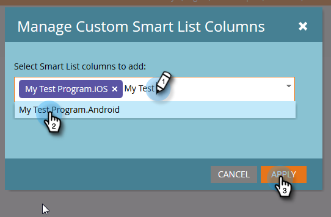

# Erstellen eines Berichts zur Leistung von Personen mit Spalten der mobilen Plattform {#build-a-people-performance-report-with-mobile-platform-columns}

Führen Sie die folgenden Schritte aus, um einen Personenleistungsbericht mit Spalten für Mobilplattformen (iOS/Android) zu erstellen.

## Mobile Smart-Listen erstellen {#create-mobile-smart-lists}

1. Gehen Sie zu **Marketing-Aktivitäten**.

   

1. Wählen Sie ein Programm.

   

1. Wählen Sie unter **Neu** **Neues lokales Element**.

   

1. Klicken Sie auf **Intelligente Liste**.

   

1. Geben Sie einen Namen ein und klicken Sie auf **Erstellen**.

   

1. Suchen und ziehen Sie den Filter Geöffnete E-Mail in die Arbeitsfläche.

   

1. Setzen Sie E-Mail auf **ist beliebig**.

   

1. Klicken Sie auf **Hinzufügen Constraint** und wählen Sie **Plattform**.

   

   >[!TIP]
   >
   >In diesem Beispiel haben wir den Filter Geöffnete E-Mail verwendet. Sie können auch den Filter &quot;Geklickte E-Mail&quot;verwenden, da er die Plattformbeschränkung hat.

1. Setzen Sie Platform auf **iOS**.

   

   >[!NOTE]
   >
   >Mindestens eine Person muss eine Ihrer E-Mails auf einem iOS-Gerät geöffnet haben, damit Marketo sie automatisch finden kann. Wenn sie nicht angezeigt wird, können Sie sie manuell eingeben und speichern.

   Erstellen Sie jetzt eine zweite intelligente Liste für die &quot;Android&quot;-Plattform. Sobald das fertig ist, fahren Sie mit dem nächsten Abschnitt fort.

## Erstellen eines Berichts zur Personenleistung {#create-a-people-performance-report}

1. Wählen Sie unter &quot;Marketing-Aktivitäten&quot;das Programm aus, in dem Ihre Smart-Listen **iOS** und **Android** enthalten sind.

   

1. Wählen Sie unter **Neu** **Neues lokales Element**.

   

1. Klicken Sie auf **Bericht**.

   

1. Legen Sie &quot;Typ&quot;auf **Personenleistung** fest.

   

1. Klicken Sie auf **Erstellen**.

   

   Du machst das großartig! Nun zum nächsten Abschnitt.

## hinzufügen Mobile Smart-Listen als Spalten {#add-mobile-smart-lists-as-columns}

1. Klicken Sie im soeben erstellten Bericht auf **Setup** und ziehen Sie **Benutzerdefinierte Spalten** in die Arbeitsfläche.

   

   >[!NOTE]
   >
   >Standardmäßig werden im Bericht &quot;Personenleistung&quot;die letzten 7 Tage angezeigt. Sie können den Zeitrahmen ändern, indem Sie die Dublette darauf klicken.

1. Suchen Sie die zuvor erstellten intelligenten Listen und wählen Sie sie aus und klicken Sie auf **Apply**.

   

1. Klicken Sie auf **Bericht**, um den Bericht auszuführen und Ihre Daten anzuzeigen.

   

   Ziemlich cool, nicht wahr? Gut gemacht!

