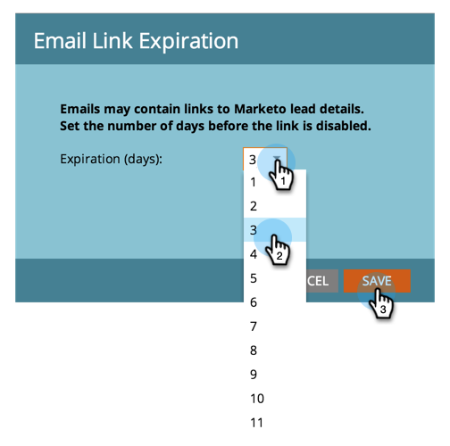

# Ändern der Ablaufzeit für URLs in Berichts-E-Mails {#change-the-expiration-time-for-urls-in-report-emails}

>[!NOTE]
>
>**Administratorberechtigungen erforderlich**

Links in Ihren Berichtsabonnement-E-Mails laufen nach drei Tagen ab. Gehen Sie wie folgt vor, um die Ablaufzeit für diese Links zu ändern.

1. Klicken **[!UICONTROL unter]** auf **[!UICONTROL Anmeldeeinstellungen]**.

   

1. Klicken Sie auf die Schaltfläche **[!UICONTROL URL-Gültigkeit bearbeiten]**.

   

1. Wählen Sie aus dem Dropdown-Menü aus, wie viele Tage bis zum Ablauf des Links. Klicken Sie auf **[!UICONTROL Speichern]**.

   

   Cool, Sie haben Ihre E-Mail-Link-Ablaufeinstellungen bearbeitet.

   >[!NOTE]
   >
   >Denken Sie daran, dass diese nur für Links in Berichten und Warnhinweisen gelten, nicht für Marketing-E-Mails.
