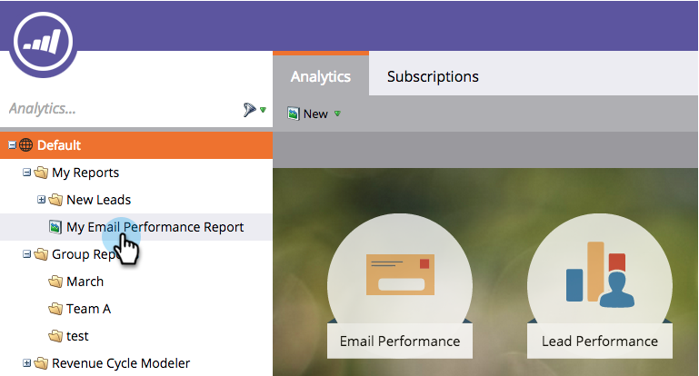
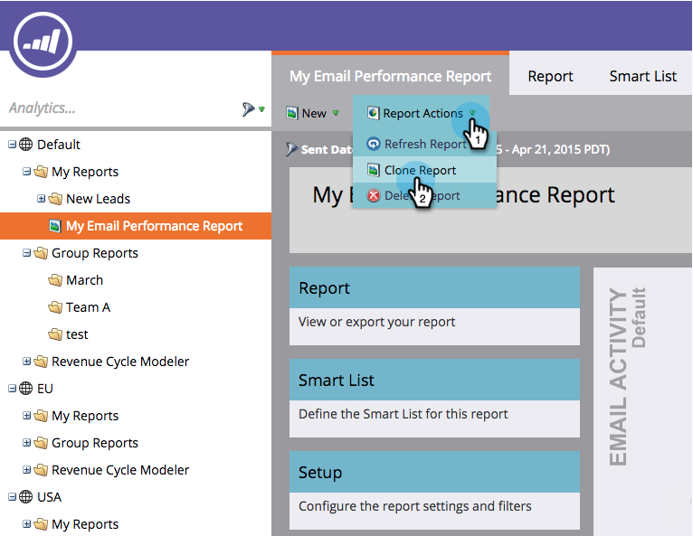
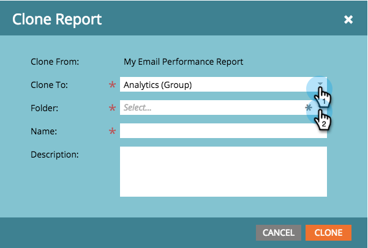
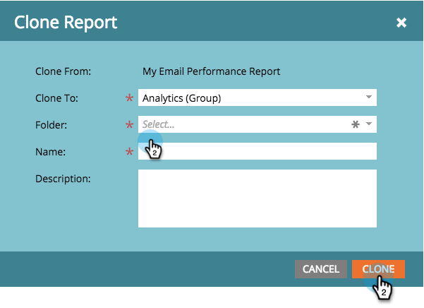

# Klonen eines Berichts in Gruppenberichte {#clone-a-report-to-group-reports}

Jeder Bericht in **[!UICONTROL Meine Berichte]** ist nur für Sie sichtbar. Was wäre, wenn Sie den Bericht für alle anderen verfügbar machen möchten? So geht das:

1. Klicken Sie im Bereich **[!UICONTROL Analytics]** auf den gewünschten [gespeicherten Bericht](/help/marketo/product-docs/reporting/basic-reporting/creating-reports/save-a-report.md).

   

   >[!NOTE]
   >
   >Alternativ kann ein gespeicherter Bericht in „Gruppenberichte **[!UICONTROL geklont werden]** indem der Bericht in den Ordner gezogen wird.

1. Klicken Sie **[!UICONTROL Berichtsaktionen]** und wählen Sie **[!UICONTROL Bericht klonen]**.

   

1. Klicken Sie auf **[!UICONTROL Klonen nach]** und wählen Sie Ihre Gruppe aus. Wählen Sie den **[!UICONTROL Ordner]** aus.

   

1. **[!UICONTROL Name]** den Bericht und klicken Sie auf **[!UICONTROL Klonen]**.

   

   Cool! Ihr Bericht wird jetzt in &quot;**[!UICONTROL &quot;]**.

   
