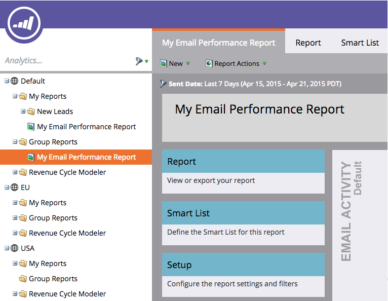

# Einen Bericht zu Gruppenberichten klonen {#clone-a-report-to-group-reports}

Alle Berichte in &quot;Meine Berichte&quot;sind nur für Sie sichtbar. Was ist, wenn Sie den Bericht allen anderen zugänglich machen möchten? So können Sie das machen:

1. Im **Analytics** Bereich, klicken Sie auf die gewünschte [gespeicherter Bericht](/help/marketo/product-docs/reporting/basic-reporting/creating-reports/save-a-report.md).

   

   >[!NOTE]
   >
   >Alternativ kann ein gespeicherter Bericht in **Gruppenberichte** durch Ziehen des Berichts in den Ordner.

1. Klicken **Berichtaktionen** und wählen Sie **Bericht klonen**.

   

1. Klicken Sie auf **Klonen zu** und wählen Sie Ihre Gruppe aus. Wählen Sie die **Ordner**.

   

1. **Name** den Bericht und klicken Sie auf **Klonen**.

   

   Cool! Ihr Bericht wird jetzt in **Gruppenberichte**.

   
