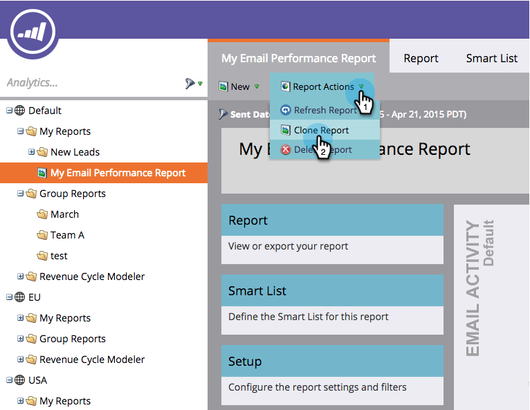

# Einen Bericht zu Gruppenberichten klonen {#clone-a-report-to-group-reports}

Jeder Bericht in **Meine Berichte **ist nur für Sie sichtbar. Was ist, wenn Sie den Bericht allen anderen zugänglich machen möchten? So können Sie das machen:

1. Klicken Sie im Bereich **Analytics **auf den gewünschten [gespeicherten Bericht](../../../../product-docs/reporting/basic-reporting/creating-reports/save-a-report.md).
1. 

   >[!NOTE]
   >
   >Alternativ kann ein gespeicherter Bericht in **Gruppenberichte **geklont werden, indem der Bericht in den Ordner gezogen wird.

1. Klicken Sie auf **Berichtsaktionen **und wählen Sie **Bericht klonen**.

   

1. **Clone** Toa  **Analytics (Gruppe)** und wählen Sie einen  **Ordner**.

   

1. **Benennen Sie** den Bericht und klicken Sie auf  **Klonen**.

   

   Cool! Ihr Bericht wird nun in den **Gruppenberichten angezeigt.**

   

