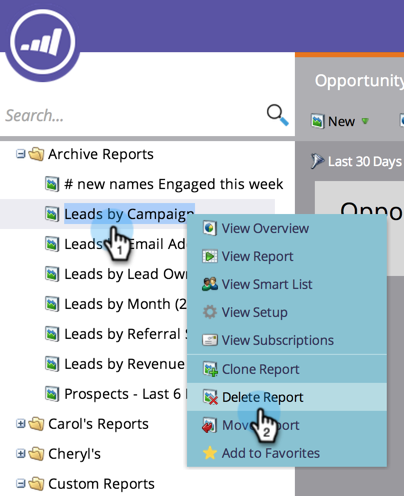

# Einen Bericht löschen {#delete-a-report}

Sobald Sie [ Berichte erstellen](/help/marketo/product-docs/reporting/basic-reporting/creating-reports/create-a-report-in-a-program.md), können Sie viele davon schnell finden. Denken Sie daran, nicht mehr benötigte Berichte zu löschen.

1. Klicken Sie mit der rechten Maustaste auf den nicht benötigten Bericht im Baum und wählen Sie **Bericht löschen** aus.

   

1. Bestätigen Sie Ihre Absicht, den Bericht zu löschen.

   

   Der Bericht verschwindet aus dem Baum. Entfernen Sie jetzt einige alte Berichte!
