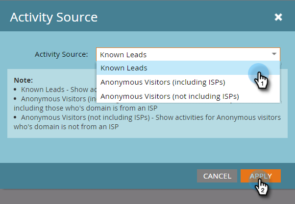

# Personen oder anonyme Besucher in Webberichten anzeigen {#display-people-or-anonymous-visitors-in-web-reports}

>[!PREREQUISITES]
>
>[Hinzufügen des Munchkin-Trackingcodes zu Ihrer Website](/help/marketo/product-docs/administration/additional-integrations/add-munchkin-tracking-code-to-your-website.md)

Im [Webseiten-Aktivität](/help/marketo/product-docs/reporting/basic-reporting/report-types/web-page-activity-report.md) und  [Webaktivitätsberichte der Firma](/help/marketo/product-docs/reporting/basic-reporting/report-types/company-web-activity-report.md) Sie können Folgendes sehen: [Personen oder anonyme Besucher](/help/marketo/product-docs/core-marketo-concepts/smart-lists-and-static-lists/managing-people-in-smart-lists/understanding-anonymous-activity-and-people.md) die Ihre Site besuchen. Den anonymen Besuchern liegen Daten vor, wie z. B. Metrobereich.  So können Sie auswählen, ob der Bericht bekannte oder anonyme Besucher anzeigt.

1. Klicken Sie im Bericht &quot;Webseiten-Aktivität&quot;auf **Einrichtung**.

   

1. Doppelklicken **Aktivitätsquelle**.

   

1. Wählen Sie im Popup-Fenster **Bekannte Leads** (Personen) oder **Anonyme Besucher** aus der Dropdown-Liste aus.

   

   >[!NOTE]
   >
   >Wenn Sie ISPs für anonyme Besucher einbeziehen, wird ein längerer Bericht generiert. Wenn Sie diese jedoch ausschließen, erhalten Sie einen klareren Überblick darüber, woher Ihre Besucher neben den Standardquellen wie Google kommen.

1. Das ist es. Klicken Sie auf **Bericht** zurück und zeigen Ihren Bericht mit bekannten oder anonymen Personen an.

   

>[!MORELIKETHIS]
>
>[Tracking anonymer Aktivitäten und Personen](/help/marketo/product-docs/reporting/basic-reporting/report-activity/tracking-anonymous-activity-and-people.md)
