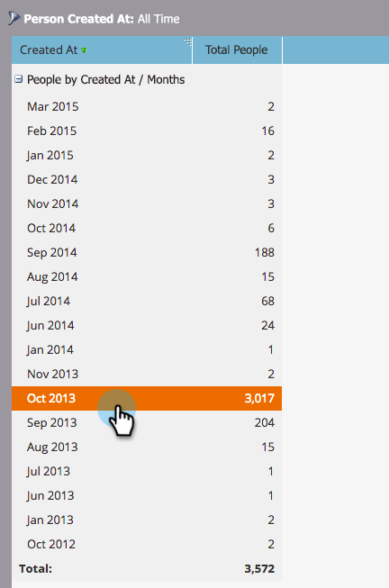
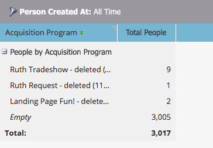

# Drilldown in einem Personenleistungsbericht {#drill-down-in-a-people-performance-report}

Drilldown in einem Personen-Leistungsbericht, um zusätzliche Personeninformationen anzuzeigen.

1. Klicken Sie auf **Bericht**, um einen vorhandenen Bericht anzuzeigen.

   

1. Wählen Sie eine Zeile im Bericht aus, über die Sie mehr erfahren möchten.

   

1. Klicken Sie auf **Aufschlüsselung**.

   

1. Wählen **im Pop** up „Drill-Down“ das Attribut aus, nach dem Sie einen Drilldown durchführen möchten. Klicken Sie dann **Drill-down**.

   

1. Gut gemacht! Der Drilldown-Bericht wird auf einer neuen Registerkarte geöffnet. Jetzt können Sie den neuen Bericht erkunden.

   >[!TIP]
   >
   >Wenn keine neue Berichtsregisterkarte geöffnet wird, blockiert Ihr Browser möglicherweise Popups. Ändern Sie Ihre Browser-Einstellungen, um dies zuzulassen.

   

1. Um die Ergebnisse zu speichern (optional), klicken Sie **unten links auf** Exportieren“-Symbol.

   
