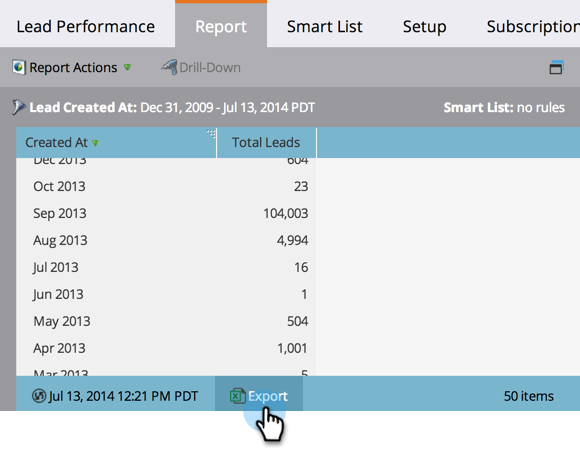

# Exportieren eines Berichts in [!DNL Excel] {#export-a-report-to-excel}

Sie können jeden Bericht in eine [!DNL Excel]-Datei exportieren, um mit den Daten in anderer Software zu arbeiten.

1. Navigieren Sie zum Bereich **[!UICONTROL Marketing-Aktivitäten]**.

   

1. Wählen Sie Ihren Bericht im Navigationsbaum aus und klicken Sie auf die Registerkarte **[!UICONTROL Bericht]**.

   

1. Klicken Sie auf **[!UICONTROL Exportieren]**.

   

   Das ist alles! Ihr Browser fordert Sie auf, die [!DNL Excel]-Datei auf Ihrem System zu speichern.

   >[!MORELIKETHIS]
   >
   >Wenn die heruntergeladene Datei zu groß ist, können [die Berichtsgröße ändern](/help/marketo/product-docs/reporting/basic-reporting/editing-reports/configure-report-size.md).
