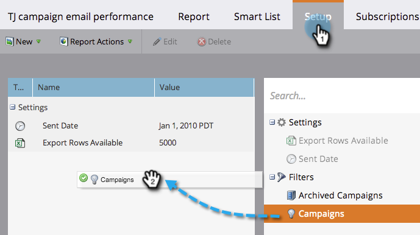

# Filtern von Assets in E-Mail-Berichten einer Kampagne {#filter-assets-in-a-campaign-email-reports}

Fokus [Leistung von Campaign-E-Mails](/help/marketo/product-docs/reporting/basic-reporting/report-types/campaign-email-performance-report.md) Bericht über spezifische [Smart-Kampagnen](/help/marketo/product-docs/core-marketo-concepts/smart-campaigns/creating-a-smart-campaign/understanding-batch-and-trigger-smart-campaigns.md) in Ihren Programmen (&quot;lokale Assets&quot;) oder archivierten Programmen angezeigt werden.

1. Navigieren Sie zu **Analytics** (oder **Marketingaktivitäten**).

   

1. Wählen Sie Ihren E-Mail-Leistungsbericht aus.

   

1. Klicken Sie auf **Einrichtung** und ziehen Sie über einen Filter.

   

   * **Kampagnen**: Aktive Smart-Kampagnen in Ihrem Marketo-Konto.
   * **Archivierte Kampagnen**: Inaktive, veraltete Smart-Kampagnen.

1. Wählen Sie die Ordner und spezifischen Smart-Kampagnen aus, die in Ihren Bericht aufgenommen werden sollen.

   

   >[!TIP]
   >
   >Wenn Sie einen Ordner auswählen, enthält der Bericht alle Elemente, die der Ordner zum Zeitpunkt der Ausführung des Berichts enthält.

1. Du bist fertig! Klicken Sie auf **Bericht** um Ihren gefilterten Bericht anzuzeigen.

   

   >[!MORELIKETHIS]
   >
   >[Bericht zur E-Mail-Leistung von Campaign](/help/marketo/product-docs/reporting/basic-reporting/report-types/campaign-email-performance-report.md)
   >[Filtern von Assets in einem E-Mail-Bericht](/help/marketo/product-docs/reporting/basic-reporting/report-activity/filter-assets-in-an-email-report.md)
