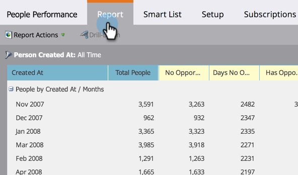

# Gruppieren von Personenberichten nach Attributen {#group-person-reports-by-attribute}

Sie können Ihre Personenberichte nach beliebigen Personen- oder Firmenattributen gruppieren.

1. Navigieren Sie zum Bereich **[!UICONTROL Marketing]** (oder **[!UICONTROL Analytics]**).

   

1. Wählen Sie in der Navigationsstruktur Ihren Personenbericht aus und klicken Sie auf die Registerkarte **[!UICONTROL Setup]**.

   

1. Doppelklicken Sie auf **[!UICONTROL Personen gruppieren nach]**.

   

   >[!NOTE]
   >
   >Sie können auch [Personenberichte nach Segment gruppieren](/help/marketo/product-docs/personalization/segmentation-and-snippets/segmentation/group-person-reports-by-segment.md).

   Wählen [!UICONTROL  Dialogfeld „Personen gruppieren nach] das Attribut für Person oder Unternehmen aus, das für die Gruppierung verwendet werden soll.

   

   >[!TIP]
   >
   >Wenn Sie ein Attribut mit einem numerischen Wert auswählen, wie _[!UICONTROL Erstellt am]_ oder _[!UICONTROL Jahresumsatz]_, wählen Sie die Metriken aus der Dropdown-Liste **[!UICONTROL Einheiten]** auf der rechten Seite aus.

   Klicken Sie auf **[!UICONTROL Registerkarte]** Bericht“, um den Bericht entsprechend gruppiert anzuzeigen.

   

   >[!MORELIKETHIS]
   >
   >[Hinzufügen benutzerdefinierter Spalten zu einem Personenbericht](/help/marketo/product-docs/reporting/basic-reporting/editing-reports/add-custom-columns-to-a-person-report.md)
