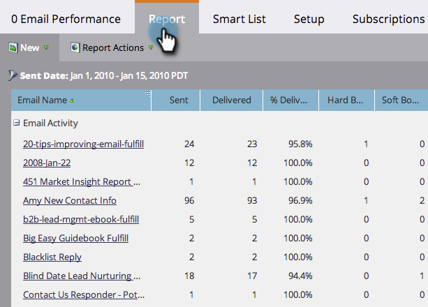

# Bericht zur E-Mail-Kampagnenleistung in allen Arbeitsbereichen {#report-email-campaign-performance-across-workspaces}

Aktivieren Sie die globale Berichterstellung, um Daten aus allen Marketo [Arbeitsbereichen](/help/marketo/product-docs/administration/workspaces-and-person-partitions/create-a-new-workspace.md) in Ihre Berichte [E-Mail](/help/marketo/product-docs/email-marketing/email-programs/email-program-data/email-performance-report.md) und [E-Mail-Link](/help/marketo/product-docs/email-marketing/email-programs/email-program-data/email-link-performance-report.md) aufzunehmen.

1. Wechseln Sie **[!UICONTROL Bereich]** Analytics“ (oder **[!UICONTROL Marketing-]**).

   

1. Wählen Sie Ihren Bericht.

   

1. Klicken Sie auf **[!UICONTROL Registerkarte]** Setup“ und doppelklicken Sie auf **[!UICONTROL Globale Berichterstellung]**.

   

1. Wählen Sie **[!UICONTROL Aktiviert]** aus.

   

1. Das ist alles! Klicken Sie auf **[!UICONTROL Bericht]**, um Daten aus allen Ihren Arbeitsbereichen anzuzeigen.

   

   >[!MORELIKETHIS]
   >
   >[Filtern von Assets in einem E-Mail-Bericht](/help/marketo/product-docs/reporting/basic-reporting/report-activity/filter-assets-in-an-email-report.md)
