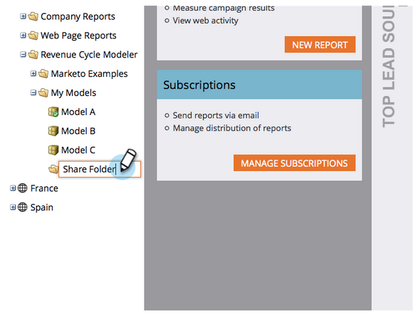
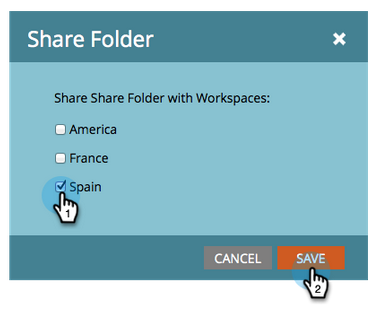

# Freigeben eines Modells über Arbeitsbereiche hinweg {#share-a-model-across-workspaces}

Marketo bietet die Möglichkeit, ein Modell(e) über Arbeitsbereiche hinweg freizugeben. Und so geht das.

1. Navigieren Sie zum Abschnitt **[!UICONTROL Analytics]**.

   

1. Klicken Sie mit der rechten Maustaste auf **[!UICONTROL Ordner]** Meine Modelle **[!UICONTROL und dann auf Neuer Ordner]**.

   

1. Benennen Sie den Ordner.

   

1. Ziehen Sie das/die Modell(e), das/die Sie freigeben möchten, in den **[!UICONTROL Freigabeordner]**.

   

1. Klicken Sie mit der rechten Maustaste auf den Ordner und **[!UICONTROL Sie auf Ordner freigeben]**.

   

   >[!NOTE]
   >
   >Durch die Freigabe eines Modells mit einem anderen Arbeitsbereich können diese Benutzer auf Grundlage des Modells Berichte ausführen.

1. Wählen Sie die Arbeitsbereiche aus, für die Sie den Ordner freigeben möchten, und klicken Sie auf **[!UICONTROL Speichern]**.

   

So einfach ist das! Jetzt können sich Personen aus anderen Arbeitsbereichen durch das freigegebene Modell bewegen.
