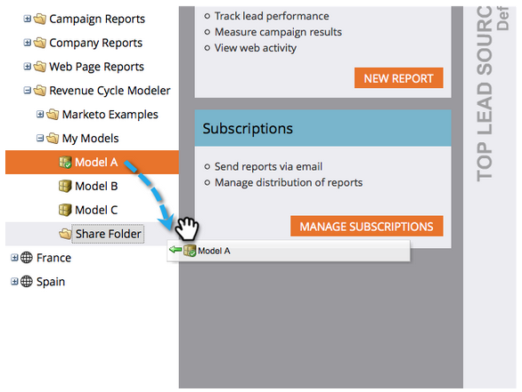

# Modell über Arbeitsbereiche hinweg freigeben {#share-a-model-across-workspaces}

Marketo bietet Ihnen die Möglichkeit, ein oder mehrere Modelle über Arbeitsbereiche hinweg freizugeben. So geht es.

1. Navigieren Sie zu **Analytics** Abschnitt.

   

1. Rechtsklicken Sie auf die **Meine Modelle** Ordner und klicken Sie auf **Ordner**.

   

1. Benennen Sie den Ordner.

   

1. Ziehen Sie die Modelle, die Sie freigeben möchten, in die **Ordner freigeben**.

   

1. Klicken Sie mit der rechten Maustaste auf den Ordner und klicken Sie auf **Ordner freigeben**.

   

   >[!NOTE]
   >
   >Durch die Freigabe eines Modells für einen anderen Arbeitsbereich können diese Benutzer Berichte auf der Grundlage des Modells ausführen.

1. Wählen Sie die Arbeitsbereiche aus, für die Sie den Ordner freigeben möchten, und klicken Sie auf **Speichern**.

   

So einfach ist es! Jetzt können Personen aus anderen Arbeitsbereichen durch das gemeinsam genutzte Modell navigieren.
