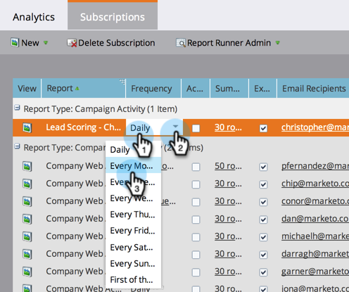

# Berichtabonnements verwalten {#manage-report-subscriptions}

Konfigurieren und Löschen von Berichtsabonnements.

1. Wechseln Sie zum Bereich **Analytics**.

   

1. Klicken Sie auf **Registerkarte** Abonnements“.

   

   Auf dieser Seite werden die Abonnements aller Berichte in Ihrem Konto nach [Berichtstyp](/help/marketo/product-docs/reporting/basic-reporting/report-types/report-type-overview.md) angezeigt. Dazu gehören [Abonnements für Basisberichte](/help/marketo/product-docs/reporting/basic-reporting/report-subscriptions/subscribe-to-a-basic-report.md) und Umsatzzyklus-Explorer-Berichte.

   >[!TIP]
   >
   >Sie können auch Abonnements für einen einzelnen Bericht in **Marketing-Aktivitäten“**. Wählen Sie den Bericht aus und klicken Sie auf **Registerkarte** Abonnements“.

   Um zu ändern, wie oft ein Bericht per E-Mail gesendet wird, klicken Sie auf das Feld Häufigkeit und wählen Sie eine neue Option aus dem Dropdown-Menü aus.

   

1. Um die E-Mail-Adressen in einem Abonnement zu ändern, klicken Sie auf das Feld **E-Mail** Empfänger und bearbeiten Sie die E-Mail-Adressen.

   

   >[!TIP]
   >
   >* Verwenden Sie Kommas zwischen E-Mail-Adressen.
   >* Um Ihre Änderungen zu speichern, klicken Sie in einen Bereich _außerhalb_ der Abonnement-Liste.

   Alternativ können Sie auch folgendermaßen vorgehen:

   * Klicken Sie auf **Ansicht**, um einen Bericht zu öffnen.
   * Deaktivieren Sie das **Aktiv**-Kontrollkästchen, um das Abonnement zu deaktivieren.
   * Klicken Sie auf das Feld **Zusammenfassung** und bearbeiten Sie es, um zu ändern, wie viele Vorschauzeilen in der E-Mail angezeigt werden.
   * Deaktivieren Sie das **Excel**-Kontrollkästchen, um Berichtszusammenfassungen ohne Tabellenanhang zu senden.
   * Klicken Sie auf **Senden**, um die Berichts-E-Mail sofort zu senden.

1. Um ein Abonnement vollständig zu löschen, wählen Sie die Zeile aus und klicken Sie auf **Abonnement löschen**.

   

1. Bestätigen Sie Ihre Absicht, das Abonnement zu löschen.

   

   >[!MORELIKETHIS]
   >
   >* [Abonnieren eines Basisberichts](/help/marketo/product-docs/reporting/basic-reporting/report-subscriptions/subscribe-to-a-basic-report.md)
   >* [Abonnieren eines Revenue Explorer-Berichts](/help/marketo/product-docs/reporting/revenue-cycle-analytics/revenue-explorer/subscribe-to-a-revenue-explorer-report.md)
